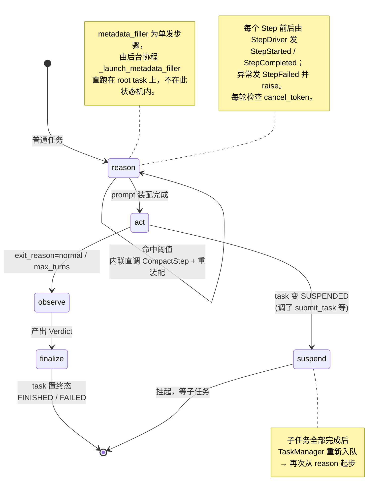

# ctx-weft 内部实现逻辑

> 本文讲 **引擎内部如何运转**：循环引擎、Step 流水线、上下文装配、任务编排、记忆写入时机、会话生命周期与崩溃恢复、事件系统内部。
>
> 想知道**怎么调用 SDK**，见 [README.md](./README.md)。这里的内容对编写自定义 Provider、调试事件流、扩展引擎有帮助，但日常使用不必读。

---

## 目录

1. [架构总览与数据流](#1-架构总览与数据流)
2. [核心组件职责](#2-核心组件职责)
3. [Loop 引擎与 Step 流水线](#3-loop-引擎与-step-流水线)
4. [LoopState / LoopContext / StepOutcome](#4-loopstate--loopcontext--stepoutcome)
5. [上下文装配（ContextAssembler）](#5-上下文装配contextassembler)
6. [能力解析与调用（CapabilityGateway）](#6-能力解析与调用capabilitygateway)
7. [任务编排与 Agent 解析](#7-任务编排与-agent-解析)
8. [记忆写入时机](#记忆写入时机)
9. [Blackboard / Topic 机制](#blackboard--topic-机制)
10. [会话生命周期与崩溃恢复](#会话生命周期与崩溃恢复)
11. [事件系统内部](#10-事件系统内部)

---

## 1. 架构总览与数据流

```
                         ┌──────────────────────────────────────┐
                         │            CtxWeftRuntime               │
                         │                                        │
 TemplateResolver ──────▶│  LifecycleManager   instantiate_agent  │
                         │  SessionManager     create/resume      │
 ProviderRegistry ──────▶│  TaskManager        队列 / drain        │
   memory/cap/know/llm   │                                        │
                         └───────────────┬────────────────────────┘
                                         │ _execute_task(task, agent, template)
                                         ▼
        ┌──────────────────────  一次 loop run  ──────────────────────┐
        │  ContextAssembler ──▶ AssembledPrompt                        │
        │  CapabilityGateway ──▶ invoke / 鉴权 / 写 memory             │
        │  LLMClient         ──▶ 流式 chunk                            │
        │                                                              │
        │  StepDriver: reason → act → observe → finalize               │
        │              （compact / suspend / metadata_filler 按需）     │
        └───────────────────────────┬──────────────────────────────────┘
                                     │ make_event(...)
                                     ▼
                EventBus（InProcessEventBus，append-only）
                                     │ 订阅
                          ┌──────────┴──────────┐
                     EventStore            外部订阅者（SSE / 日志）
                  (InMemoryEventStore)
```

**一句话**：`CtxWeftRuntime` 把一个 `(Task, Agent, AgentTemplate)` 交给 `_execute_task`，后者组装好
`LoopContext` 与 `LoopState`，由 `StepDriver` 按 `next_step` 顺序跑 Step；每个 Step 产生
`StepOutcome`（状态补丁 + 事件），事件全部经 `EventBus` 流出，`EventStore` 默认订阅落盘。

---

## 2. 核心组件职责

> 路径均相对 `ctx-weft/`，行号对应当前 `master`，可点击跳转。

| 组件 | 源码（file:line） | 职责 |
|------|------------------|------|
| `CtxWeftRuntime` | `src/ctx_weft/core/runtime.py:343` | 顶层编排：构造依赖、5 种运行入口、`_execute_task` |
| `ProviderRegistry` | `src/ctx_weft/core/runtime.py:163` | 四类 provider 注册表（memory 唯一 / cap 列表 / knowledge 按 priority / llm 唯一） |
| `LifecycleManager` | `src/ctx_weft/core/orchestrator/lifecycle_manager.py:30` | 从 template 实例化 `Agent`（`instantiate_agent` `:35`，含 spawn_depth / 父子关系） |
| `SessionManager` | `src/ctx_weft/core/orchestrator/session_manager.py:22` | `create_session` `:28` / `resume_session` `:77`，建 Session + root Task + TaskManager |
| `TaskManager` | `src/ctx_weft/core/orchestrator/task_manager.py:41` | 任务队列、`drain()` `:204` 调度、`track_background` `:76`（后台协程登记）、`restore` `:96` |
| `ContextAssembler` | `src/ctx_weft/core/assembler/assembler.py:140` | 多 Source 取数 → budget 裁剪 → composer 拼 prompt |
| `CapabilityGateway` | `src/ctx_weft/core/loop/capability_gateway.py:52` | capability 解析、鉴权、`invoke` `:75`、把调用/结果写 memory + 发事件 |
| `CapabilityCache` | `src/ctx_weft/core/orchestrator/capability_cache.py:21` | per-agent 能力缓存，loop 结束 `evict(agent.id)` |
| `StepDriver` | `src/ctx_weft/core/loop/driver.py:155` | 按 `initial_step` 起步，`run()` `:162` 循环执行 Step，发 StepStarted/Completed/Failed |
| `EventBus` / `InProcessEventBus` | `src/ctx_weft/core/events/bus.py:42` / `:79` | 进程内事件总线，`emit()` `:88` / `stream()` `:142` |
| `EventStore` / `InMemoryEventStore` | `src/ctx_weft/core/state/event_store.py:43` / `:82` | 事件持久化 + `list_active_session_ids` `:113` + 回放支撑 |
| `HitlManager` | `src/ctx_weft/core/orchestrator/hitl_manager.py:40` | 人工介入请求/应答（`approve` `:96` / `reject` `:120`） |

**自动注册的内置 Capability**（在 `CtxWeftRuntime.__init__`，`src/ctx_weft/core/runtime.py:369`）：
- `ControlCapabilityProvider`（`src/ctx_weft/core/orchestrator/control_capability.py:366`）— submit_task / submit_plan / replan / submit_task_assessment / update_task_metadata / request_human_input
- `SkillExecutorCapabilityProvider`（`src/ctx_weft/core/orchestrator/skill_executor_capability.py:124`）— 把 LLM 的 skill 调用路由到对应的 `SkillCapabilityProvider`；`ProviderRegistry` 在 skill provider 增减时调用 `mark_dirty()` 让它重建索引。

---

## 3. Loop 引擎与 Step 流水线

`StepDriver.run()`（`src/ctx_weft/core/loop/driver.py:162`）是引擎心脏。流程：

1. **起步前持久化 user_prompt**：若 `task.user_prompt` 未入库，先 `ingest` 一条
   `USER_PROMPT`（拼成 `## Current Task` + `## Current Message`），并置 `user_prompt_in_memory=True`——
   保证 resume 时对话上下文可完整重建。
2. 从 `initial_step` 开始循环：
   - 每轮先检查 `cancel_token`，已取消则抛出（→ 上层标记 `CANCELED`）。
   - 发 `StepStarted` → 执行 `step.execute(state, ctx)` → 应用 `outcome.state_patch` →
     发 `outcome.events` → 发 `StepCompleted`。
   - Step 抛异常时发 `StepFailed` 再 raise。
   - `next_step = outcome.next_step`；为 `None` 时循环结束。

### Step 注册表与跳转

`_build_step_driver(initial_step)`（`src/ctx_weft/core/runtime.py:900`）注册 7 个 Step：

| Step | 源码（file:line） | 作用 | `next_step` |
|------|------------------|------|-------------|
| `reason` | `src/ctx_weft/core/loop/steps/reason.py:29` | 装配 prompt（ContextAssembler）；命中阈值则内联直调 CompactStep 后重装配 | `"act"` |
| `act` | `src/ctx_weft/core/loop/steps/act.py:35` | ReAct 循环：调 LLM → 执行 tool_call → 写 memory，直到无工具调用 / max_turns | `"observe"`；若 task 变 `SUSPENDED` 则 `"suspend"` |
| `observe` | `src/ctx_weft/core/loop/steps/observe.py:38` | Observer 评估，产出 `Verdict`（outcome + summary） | `"finalize"` |
| `finalize` | `src/ctx_weft/core/loop/steps/finalize.py:20` | 写 `OBSERVER_SUMMARY`、置 task 终态、发 TaskFinished | `None` |
| `suspend` | `src/ctx_weft/core/loop/steps/suspend.py:18` | 当前 task 等子任务，挂起 | `None`（TaskManager 在子任务完成后重新入队） |
| `compact` | `src/ctx_weft/core/loop/steps/compact.py:30` | 记忆压缩：复用 act 装配 + 尾部压缩指令，产出 `[Context so far]` 摘要、调 `apply_compact`；由 ReasonStep 内联直调（非 task） | `None` |
| `metadata_filler` | `src/ctx_weft/core/loop/steps/metadata_filler.py:25` | 单发步骤：回填 title/description/session goal；由后台协程 `runtime._launch_metadata_filler` 直跑在 root task 上 | `None` |

**典型链路**：`reason → act → observe → finalize → (None)`。
- `act` 中若 LLM 调了 `submit_task` 等控制工具把当前 task 置 `SUSPENDED`，则走 `act → suspend`。
- `reason` 检测到 token 超阈值时，**内联直调** `CompactStep`（不派发 task、不挂起），压缩复用 act 装配 + 尾部压缩指令；压缩后在新 memory 上重装配 prompt，继续 `→ act`。

### Step 状态机

`initial_step` 由 `_resolve` 选定：普通 task 一律 `reason`。`compact` 不再作为 task 起步（由 ReasonStep 内联直调），
`metadata_filler` 不再作为 task 起步（由后台协程直跑）。`None` 表示本次 loop run 结束（`RunFinished`）；
`SUSPENDED` 任务的子任务全部完成后，由 `TaskManager` 重新入队、以 `reason` 再次起步。



ASCII 版（同一张图）：

```
                    initial_step = reason（普通 task 一律如此）
        │
        │  命中 token 阈值：内联直调 CompactStep（非 task，无 suspend）
        │  ┌──────────────────────────────────────────────────┐
        │  │ compact: 复用 act 装配 + 尾部压缩指令              │
        │  │  → 写 COMPACT_SUMMARY + apply_compact → 重装配     │
        │  └──────────────────────────────────────────────────┘
        ▼
   ┌─────────┐   task 变 SUSPENDED   ┌──────────┐  挂起等子任务   None
   │ reason  │                       │          │
   │  →act   ├──────────────────────►│ suspend  ├──────────────► (TaskManager
   └────┬────┘  (调 submit_task 等)  └──────────┘   子任务完成后    重新入队 → reason)
        │ exit_reason = normal / max_turns
        ▼
   ┌─────────┐      ┌──────────┐   task 置终态
   │ observe ├─────►│ finalize ├──────────────► None  (RunFinished)
   └─────────┘      └──────────┘   FINISHED / FAILED

  ※ metadata_filler 为单发步骤，由后台协程 _launch_metadata_filler
    直跑在 root task 上，复用 act 装配 + 尾部 metadata 指令；不在主状态机内。
  ※ 每个 Step：StepDriver 发 StepStarted → execute → 应用 state_patch
    → 发 events → StepCompleted；异常发 StepFailed 后 raise。
    每轮起始检查 cancel_token，已取消则抛出 → CANCELED + RunCanceled。
```

### `_run_loop`：生命周期与错误语义

`_run_loop`（`src/ctx_weft/core/runtime.py:915`）包裹 driver：

- 开始发 `RunStarted`（带 `run_id` + `initial_step`）。
- `asyncio.CancelledError` → `was_cancelled=True`，task 置 `CANCELED`，发 `RunCanceled` + `TaskCanceled`。
- 其他异常 → task 置 `FAILED` + `task.error`；按 `exc.retriable` 决定日志级别。
- `finally`：`capability_cache.evict(agent.id)`；计算 `will_retry`（有错 + `retry_count < max_retries` +
  `retriable`）；发 `RunFinished`（含 `final_status` / `will_retry` / `total_events` / `total_turns` / `error` / `error_type`）。
- 有非取消错误时 `_run_loop` 末尾 re-raise，交由 `TaskManager` 决定是否重试。

---

## 4. LoopState / LoopContext / StepOutcome

> 三者均定义于 `src/ctx_weft/core/loop/driver.py`：`StepOutcome` `:38`、`LoopState` `:63`、`LoopContext` `:95`、`make_event` `:124`。

```python
@dataclass
class LoopState:                 # 跨 Step 的可变状态，Driver 维护，按 patch 增量更新
    run_id; session; task; agent; scope
    sequence_counter: int = 0    # 每发一个事件 +1（事件 sequence 来源）
    assembled_prompt: AssembledPrompt | None   # ReasonStep 写入
    transcript: list[TurnRecord]               # ActStep 写入（每轮 LLM 文本/工具）
    act_exit_reason: str                       # "normal" / "max_turns"
    verdict: Verdict | None                    # ObserveStep 写入
    extra: dict                                # 如 {"template": AgentTemplate}
    def apply_patch(self, patch) -> LoopState  # dataclasses.replace 浅拷贝

@dataclass
class LoopContext:               # 每次 run 一个，包所有跨 Step 依赖（只读为主）
    assembler; llm; memory; event_bus; provider_ctx
    capability_cache; capability_providers; capability_gateway
    skill_provider_index         # provider_name → SkillCapabilityProvider（ReasonStep 加载 Level2）
    cancel_token; pause_token; template_resolver; task_manager

@dataclass
class StepOutcome:               # 每个 Step 的统一返回
    next_step: str | None
    state_patch: dict = {}       # 合并进 LoopState
    events: list[Event] = []     # Driver 负责 emit
    request_pause: bool = False
```

`make_event(state, type, payload, ...)`（`src/ctx_weft/core/loop/driver.py:124`）：自增
`state.sequence_counter`，生成 `evt_ULID`，填好 `run_id / session_id / task_id / agent_id / tenant_id`。
**类型不在 `EVENT_TYPES` 直接 `ValueError`**。

---

## 5. 上下文装配（ContextAssembler）

`_build_assembler`（`src/ctx_weft/core/runtime.py:839`）固定装配 6 个 Source + budget + composer：

```python
ContextAssembler(                    # src/ctx_weft/core/assembler/assembler.py:140
    sources=[
        IdentitySource(),            # sources/identity.py:14    → system prompt（SOUL/ROLE）
        CapabilitySource(),          # sources/capability.py:20  → 首条 user message 前缀 + LLM tools
        RecentMemorySource(),        # sources/short_memory.py:26 → messages（recall_recent）
        BlackboardSource(),          # sources/blackboard.py:21   → messages（订阅 topic）
        SemanticRecallSource(),      # sources/long_memory.py:17  → messages（recall_semantic）
        KnowledgeRetrievalSource(),  # sources/knowledge.py:15    → messages（user 引用块）
    ],
    budget=PriorityBudgetStrategy(),  # assembler/budget.py:32   按 priority 填充，超预算裁剪
    composer=DefaultComposer(),       # assembler/composer.py:99 拼成单条 user message + system
    deps=AssemblerDeps(memory, knowledge_providers, provider_ctx, skill_provider_index),
)
```

> Source 均位于 `src/ctx_weft/core/assembler/sources/`，budget/composer 位于 `src/ctx_weft/core/assembler/`。

产物 `AssembledPrompt`：含 `system` 文本、`messages`（通常压成单条 user message，内含
`## Current Message` 段）、`tools`（LLMTool 列表）、`token_count`。

**Identity 是一等公民**：直接来自 `AgentTemplate.identity[purpose]`，不经过 capability。
**Knowledge 作为 user 引用块**进 messages（"这是我刚查到的资料"），不进 system prompt。

---

## 6. 能力解析与调用（CapabilityGateway）

`_build_gateway`（`src/ctx_weft/core/runtime.py:865`）每次 run 新建一个 `CapabilityGateway`
（`src/ctx_weft/core/loop/capability_gateway.py:52`），注入：`capability_cache`、
`capability_providers`、`memory`、`event_bus`、`provider_authorizers`。

ActStep 里一次工具调用（`_invoke_tool`，`src/ctx_weft/core/loop/steps/act.py:266`，
最终走 `CapabilityGateway.invoke` `:75`）的链路：

1. 按 `tool_call.name` 在已 retrieve 的 capability 中解析出 `capability_id` 与归属 provider。
2. **鉴权**：查 `provider_authorizers`（key 可为 `provider_name` 或完整 `capability_id`），
   命中 `HumanConfirmationAuthorizer` 则走 HITL 暂停等待。
3. 发 `CapabilityStarted`，`ingest` 一条 `TOOL_INVOCATION`。
4. 调 `provider.invoke()`，逐 `CapabilityEvent` 转发为 `CapabilityProgress`；`result`/`error`
   汇总后发 `CapabilityFinished`，`ingest` 一条 `TOOL_RESULT`。

`CapabilityCache` 按 `agent.id` 缓存「本次会话内某 agent 可见的 capability 集合」，loop 结束
`evict(agent.id)`。

> `gateway` 为 `None` 时 ActStep 退化为旧 inline 路径（仅向后兼容，正常不会发生）。

---

## 7. 任务编排与 Agent 解析

### TaskManager.drain()

`start_session` / `recover_session` 末尾 `_register_and_drain`（`src/ctx_weft/core/runtime.py:570`）会：
1. 把 session 注册进 `ControlCapabilityProvider`（让控制工具能操作 Task/Session）。
2. 设置 `session_done_callback`（清理 cancel_token + 注销 session）。
3. （恢复路径）按条件重新拉起 metadata_filler 后台协程（root title 为空时，`runtime._launch_metadata_filler`）。
4. `asyncio.create_task(task_manager.drain())` —— 后台调度循环。

`drain()`（`src/ctx_weft/core/orchestrator/task_manager.py:153`）从队列取 `PENDING` 任务，受
`max_concurrent_tasks` 限制并发，调用 `runner(session_id, task_id)`。子任务由控制工具
（submit_task/submit_plan）入队；父任务 `SUSPENDED` 等子任务，子任务全部完成后父任务重新入队。

### `_make_task_runner` 的 `_resolve`

`runner`（`_make_task_runner`，`src/ctx_weft/core/runtime.py:602`）拿到 `task_id` 后，
`_resolve(task, session_id)`（`src/ctx_weft/core/runtime.py:640`）依据 `task.settings` 决定
`(agent, template, initial_step, run_id)`——这是「一个 task 用什么 agent、从哪个 Step 起步」的核心分派：

| `task.settings` | agent 来源 | initial_step |
|-----------------|-----------|--------------|
| `NormalTaskSettings(use_subagent=True)` | 实例化子 agent（继承父 agent）；按需 flush tracking + 继承 memory | `"reason"` |
| 其它（普通任务） | 默认 / 复用 root agent | `"reason"` |

compact 与 metadata_filler 不再作为 task 起步：compact 由 ReasonStep 命中阈值后**内联直调**，
metadata_filler 由后台协程 `runtime._launch_metadata_filler` 直跑在 root task 上。`CompactTaskSettings`
保留为 dataclass（反序列化兼容 + done 检测），但 `_resolve` 已不再据其分派 initial_step。

两个记忆相关副作用（仅子 agent 路径）：
- `_flush_tracking_memory`（`src/ctx_weft/core/runtime.py:108`）：把 `agent.tracking_task_ids`
  里前序任务的结果/报告作为 `OBSERVER_SUMMARY` 写入当前 agent scope，写完标记 `fetched`。
- `_copy_memory_for_inherit`（`src/ctx_weft/core/runtime.py:63`，`inherit_memory=True`）：把父
  agent scope 的近期 `USER_PROMPT / OBSERVER_SUMMARY / COMPACT_SUMMARY`（≤50 条）快照复制到子 agent scope。

每个 task 起跑前发 `TaskStarted`。run 结束后把终态 `LoopState` 回写 `handle._state`。

---

## 记忆写入时机

core 在以下时机自动 `ingest`（provider 自由决定是否持久化/索引）：

| MemoryEventType | 写入位置（file:line） | 说明 |
|-----------------|---------------------|------|
| `USER_PROMPT` | `StepDriver.run` 起步 · `loop/driver.py:162` | 任务首次进入，拼 `## Current Task` + `## Current Message` |
| `LLM_RESPONSE` | ActStep 每轮 LLM 调用后 · `loop/steps/act.py:35` | actor 一轮完整输出 |
| `TOOL_INVOCATION` | CapabilityGateway invoke 前 · `loop/capability_gateway.py:75` | 一次 capability 调用 |
| `TOOL_RESULT` | CapabilityGateway invoke 后 · `loop/capability_gateway.py:75` | capability 返回值 |
| `OBSERVER_SUMMARY` | FinalizeStep · `loop/steps/finalize.py:20` | Observer 的 `verdict.summary`；也用于子任务结果回灌父 agent |
| `COMPACT_SUMMARY` | CompactStep · `loop/steps/compact.py:61` | 压缩产出的 `[Context so far]` |
| `BLACKBOARD_PUBLISH` | 显式发布 | topic 发布（父子/跨 session 通信） |

> 路径相对 `src/ctx_weft/core/`。

`apply_compact(scope, summary, keep_last, ctx)`：写入一条 `COMPACT_SUMMARY`，并把 scope 内此事件
之前、超出 `keep_last` 的事件标记 `superseded`（内存实现物理归档，外部实现可仅更新索引）。

---

## Blackboard / Topic 机制

> 核心认知：**CtxWeft 没有独立的 blackboard 存储**。blackboard / 短期记忆 / 长期记忆是
> 同一个 `MemoryProvider` 的不同用法。所谓 blackboard，就是「带 `topic` 标签的 memory 事件 + 订阅」。

### 数据模型

- `MemoryEvent`（`protocols/memory.py`）：`type / scope / content / timestamp / role / topic / metadata`。
- `MemoryEventType`：`USER_PROMPT / LLM_RESPONSE / TOOL_INVOCATION / TOOL_RESULT / OBSERVER_SUMMARY / COMPACT_SUMMARY / BLACKBOARD_PUBLISH`。
- `Subscription`：`session_id / task_id / topic / cursor / intent`（`task_id` = 订阅方任务，`""` 表示 session 级）。
- `intent`：`subtask`（自己派生的子任务结果，可 review/reopen）/ `predecessor`（同 plan 前序结果，只读）/ `long_term_background`（→system）/ `long_term_project_log`（→messages）。`subtask` vs `predecessor` 的区分用于 observe 渲染分段与 review 权限校验。

### 两条索引轴

每条 ingest 同时拿两个序号：

| 轴 | key | 序号 | 用途 |
|---|---|---|---|
| scope 轴 | `tenant\|session\|agent`（**task_id 被忽略**） | `seq_no` | `recall_recent`——agent 历史 |
| topic 轴 | `topic` 字符串（全局，跨 scope/session） | `topic_seq_no` | `recall_topic`——跨 task 通信 |

### 三种召回

- `recall_recent(scope, types, limit)`：按 `tenant\|session\|agent` + 类型，`seq_no` 倒序，跳过 superseded。
- `recall_topic(topic, since)`：按 `topic` + `topic_seq_no > since`，正序，返回 `(records, new_cursor)`，**跳过 superseded**。
- `recall_semantic`：V1 返空。

### 发布（Publish）

唯一发布点 `FinalizeStep`（仅 task `success`）：`ingest(MemoryEvent(type=BLACKBOARD_PUBLISH, topic=task.id, content=outputs+process_report, metadata={task_id, title, outcome, parent_task_id}))`。
随后另发一个 EventBus 的 `BLACKBOARD_PUBLISHED`（投影/SSE 用，非 memory）。

**覆盖语义**：`ingest` 写入 `BLACKBOARD_PUBLISH` 时，把同 `topic` 之前未 superseded 的
`BLACKBOARD_PUBLISH` 标记为 superseded——同一 task 的结果 topic **只保留最新一条**，reopen 重跑后自动覆盖旧结果。

### 订阅（Subscribe）

`subscribe_topic(session_id, topic, intent, ctx, task_id="")`：存一条 `Subscription`，键
`(session_id, task_id, topic)`，**幂等**（已存在则保留 cursor）。

订阅在 **driver 的 task 启动钩子**（`StepDriver.run` 起步，持有 `ctx.memory` + `ctx.task_manager`）里按需建立，每次 run 幂等执行：
- **前序订阅**：`task.tracking_task_ids`（同 plan 的全部前序）→ `subscribe_topic(topic=pred_id, intent="predecessor", task_id=task.id)`。
- **子任务订阅**：`task_manager.children_of(task.id)`（父 resume 后才有子任务）→ `subscribe_topic(topic=child_id, intent="subtask", task_id=task.id)`。
- 同一 topic 同时是前序又是子任务时按前序（只读）处理，避免重复订阅。

### 消费与渲染

`BlackboardSource.fetch`：`list_subscriptions(session_id, task_id=request.task.id)`（只取本 task 的订阅 + session 级订阅）→ 逐个 `recall_topic(topic, since=cursor)` → 产出
`ContextBlock`（`subtask`/`predecessor`/`project_log`→messages，`background`→system），`intent` 透传进 block.metadata。
Composer 在 observe 阶段按 `intent` **分段渲染**（每行 `- {title} [{outcome}]: {content}`，标题取自 record.metadata）：
- `subtask` → **"Your sub-task results (you may confirm / reopen these)"**——review/reopen 工具按标题引用的就是这一段。
- `predecessor` → **"Upstream task results (read-only context)"**——只读，不可 review/reopen。

### Review / Reopen 权限与级联

observe 的 `submit_task_assessment` 可携带 `task_reviews`：
- **权限范围**：只能 review 当前 task 自己派生的子任务（`children_of(self)`，即 "Your sub-task results" 那一段）。前序与其它任务越权 → `_collect_reviews` 拒绝并把越权标题反馈给 LLM。
- **级联 reopen**：reopen 一个 plan 步骤会触发 `TaskManager.reopen_chain(head, reason)`——head + 其同 plan 后续（`tracking_task_ids` 含 head、FINISHED、按 `created_at` 排序）一并重排，重建 `blocked_by` 链，使每个后续等前驱重跑完（重新 publish 覆盖旧结果）后再跑。
- **prompt 改写**：head 用 `## Revision required\n{reason}`；后续用 `## Upstream task revised`（指向 head 更新后的结果，结果经 blackboard 订阅自然送达）。改写均基于 `original_user_prompt`，重复 reopen 不累积。
- 因 reopen 范围限定为子任务，当前任务（parent）不是其子任务的后续，**不会被卷入级联**。

### 数据流

```
finalize(success) ──ingest(topic=task.id, supersede 旧)──> MemoryProvider(topic 轴)
                                                                  ▲
driver task-start ──subscribe_topic(task_id=自己, topic=前序/子任务)─┤
                                                                  │ recall_topic(topic, since=cursor)
BlackboardSource(task_id=当前 task) ──list_subscriptions(session, task_id)┘
        ▼
   ContextBlock ──composer(按 intent 分段)──> "Your sub-task results" / "Upstream task results"
```

### 与 OBSERVER_SUMMARY 通道的关系

父 agent 还有一条**独立**通道看到子结果：finalize 把 `OBSERVER_SUMMARY` 写进**父 scope**
（`agent_id=creator_agent_id`），父 agent 用 `recall_recent`（scope key 忽略 task_id）即可召回。
blackboard 的 topic 通道是「按需、按标题、可覆盖」的补充，二者并存。

### Provider 对齐要点

`in_memory` 与 `postgres` 两个实现必须保持一致：`subscribe_topic` 幂等 + `task_id` 维度、
`ingest` 对 `BLACKBOARD_PUBLISH` 的 topic 覆盖、`recall_topic` 跳过 superseded、`_to_record` 透传 metadata。
postgres 的 `MemorySubscriptionModel` 需含 `task_id` 列。

---

## 会话生命周期与崩溃恢复

### 新建（`start_session` `src/ctx_weft/core/runtime.py:491`，`session_id=None`）

`SessionManager.create_session`（`src/ctx_weft/core/orchestrator/session_manager.py:28`）→ 建
`Session` + root `Task` + `TaskManager` → `set_runner(_make_task_runner(...))` → 若 root_task 无标题则
启动 metadata_filler 后台协程（`runtime._launch_metadata_filler`，经 `track_background` 登记，直跑在 root task 上）→
`_register_and_drain` 启动 `drain()`。立即返回 `RunHandle`（任务在后台跑）。

### 恢复续跑（`start_session`，`session_id=<id>`）

`SessionManager.resume_session`（`src/ctx_weft/core/orchestrator/session_manager.py:77`）：回放
事件重建 Session 状态、找回 `root_agent_id`，把新的 `user_prompt` 作为后续输入，其余同新建路径。

### 崩溃恢复（进程重启）

两步，通常在应用 lifespan 启动、provider 注册完成、接收新请求之前调用：

1. **`recover(on_session_interrupted)`**（`src/ctx_weft/core/runtime.py:794`）：调
   `event_store.list_active_session_ids()`（`src/ctx_weft/core/state/event_store.py:113`，查无终态
   事件的 session，不依赖 host 投影表），逐个回调把它标记/拉起，返回数量。`list_active_session_ids`
   未实现时跳过并告警。
2. **`recover_session(session_id)`**（`src/ctx_weft/core/runtime.py:723`）：
   - `rebuild_view(event_store, session_id)`（`src/ctx_weft/core/control/reducers.py:185`）回放事件成投影。
   - `session_from_projection`（`control/converters.py:13`）/ `task_from_projection`（`control/converters.py:31`）转回 dataclass。
   - 区分终态任务（FINISHED/FAILED/CANCELED）与 `resumable`；无 resumable → `RuntimeError`。
   - `TaskManager.restore(all_tasks, terminal_ids, parked_task_ids)`（`src/ctx_weft/core/orchestrator/task_manager.py:96`）重建队列、重入队 resumable（跳过已废弃的 compact / metadata_filler ephemeral task）。
   - 用投影里的 agent 视图预建 `pre_resolved_agents`（保留 spawn_depth / parent）。
   - 条件式恢复：若 root title 仍为空则重启 metadata_filler 后台协程（`_launch_metadata_filler`）。
   - `set_runner(...)` + `_register_and_drain(session, task_manager)` 续跑。
   - 缺 `template_id` / session 不存在 → `RuntimeError`。

### 取消（`interrupt_session` `src/ctx_weft/core/runtime.py:402`）

每个 `start_session` / `recover_session` 在 `_cancel_tokens[session_id]` 注册一个 `CancelToken`
（`src/ctx_weft/core/control/tokens.py`）。`interrupt_session` 找到并 `cancel()`，返回 `bool`。
`StepDriver` 每轮检查该 token，已取消则抛出，经 `_run_loop` 转成 `CANCELED` + `RunCanceled`/`TaskCanceled`。
（`run_single_task` 不注册 token，故对它调用返回 `False`。）

---

## 10. 事件系统内部

- **总线**：`InProcessEventBus`（`src/ctx_weft/core/events/bus.py:79`），`emit(event)` `:88`
  广播给所有匹配 `EventFilter(session_id / run_id / task_id / types)` 的 `stream()` `:142` 订阅者。进程内、不跨进程。
- **顺序**：`sequence` 来自 `LoopState.sequence_counter`，在同一 `run_id` 内单调递增；
  `id` 是 `evt_ULID`（时间有序、全局唯一）。
- **白名单冻结**：`EVENT_TYPES`（`src/ctx_weft/core/events/types.py:47`）是 V1 冻结集合，`make_event`
  对未登记类型直接 `ValueError`——保证下游 reducer 的分支封闭。
- **持久化**：`CtxWeftRuntime` 默认用 `InMemoryEventStore(event_bus=...)`
  （`src/ctx_weft/core/state/event_store.py:82`），构造时即订阅总线、落盘所有事件，并支撑
  `list_active_session_ids` 与回放。传入自定义 `event_store` 时由调用方自行 wire。
- **因果链**：`causation_id` 串起「哪个事件导致了这个事件」，用于调试与回放重建。

> 因为所有状态变更都先变成事件再流出，事件流即「单一事实源」：UI 实时渲染、审计、崩溃恢复、回放
> 全部基于同一条事件流，没有旁路状态。
