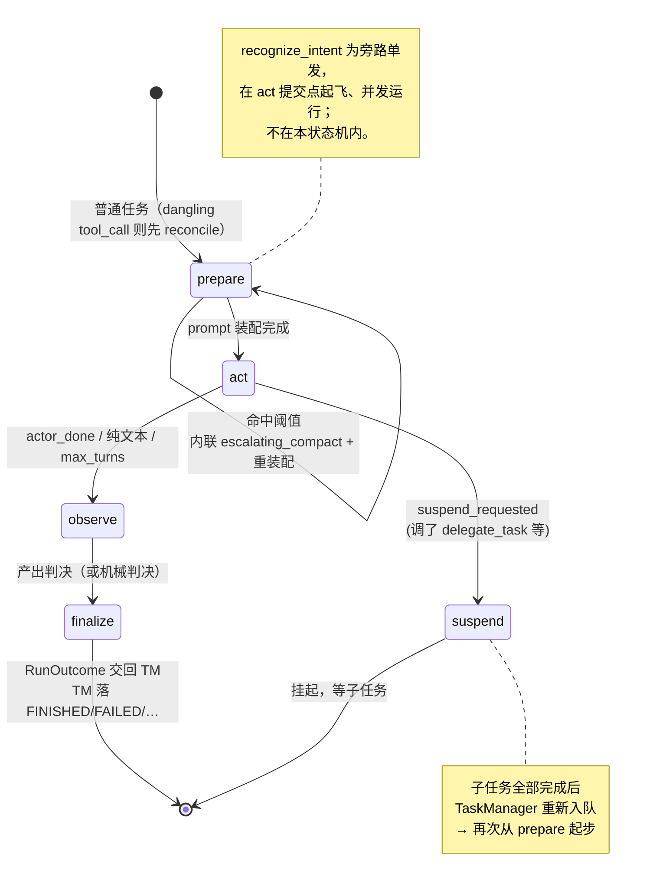

# ctx-weft 内部实现逻辑

> 本文讲 **引擎内部如何运转**：循环引擎、Step 流水线、上下文装配、任务编排、记忆模型 v2、会话生命周期与崩溃恢复、事件系统内部。
>
> 想知道**怎么调用 SDK**，见 [README.md](./README.md)。这里的内容对编写自定义 Provider、调试事件流、扩展引擎有帮助，但日常使用不必读。

---

## 目录

1. [架构总览与数据流](#1-架构总览与数据流)
2. [核心组件职责](#2-核心组件职责)
3. [Loop 引擎与 Step 流水线](#3-loop-引擎与-step-流水线)
4. [LoopState / LoopContext / StepOutcome](#4-loopstate--loopcontext--stepoutcome)
5. [上下文装配（ContextAssembler）](#5-上下文装配contextassembler)
6. [能力解析与调用（CapabilityGateway）](#6-能力解析与调用capabilitygateway)
7. [任务编排与 Agent 解析](#7-任务编排与-agent-解析)
8. [记忆模型 v2 与写入时机](#8-记忆模型-v2-与写入时机)
9. [Blackboard / Topic 机制](#9-blackboard--topic-机制)
10. [会话生命周期与崩溃恢复](#10-会话生命周期与崩溃恢复)
11. [事件系统内部](#11-事件系统内部)

---

## 1. 架构总览与数据流

```
                         ┌──────────────────────────────────────┐
                         │           CtxWeftRuntime              │
                         │  SessionRegistry   create/resume      │
  TemplateLookup ───────▶│  AgentLifecycleManager（ALM）          │
  ProviderRegistry ─────▶│  TaskManager        队列 / drain        │
   memory/cap/know/llm   │  HitlService/Registry/ReplyIntake      │
                         └───────────────┬────────────────────────┘
                                         │ 两阶段派发（task/runner.py）
                                         ▼
        ┌──────────────────────  一次 loop run  ──────────────────────┐
        │  assemble: ALM instantiate/materialize → AgentBinding        │
        │  execute : ContextAssembler ──▶ AssembledPrompt              │
        │            CapabilityGateway ──▶ invoke / 鉴权 / HITL        │
        │            LLMClient         ──▶ 流式 chunk                  │
        │                                                                │
        │  StepDriver: prepare → act → observe → finalize               │
        │     （compact 内联于 prepare；recognize_intent 旁路并发）        │
        └───────────────────────────┬────────────────────────────────────┘
                                    │ RunOutcome（execute 的返回值）
                                    ▼
                          TaskManager.apply_run_outcome
                                    │ make_event(...) / emit
                                    ▼
                EventBus（InProcessEventBus，append-only + 未提交窗口）
                                     │ 订阅
                          ┌──────────┴──────────┐
                     EventStore            外部订阅者（SSE / 日志）
              (InMemory / SQL + 快照)
```

**一句话**：`CtxWeftRuntime` 把 task 交给**两阶段 TaskRunner**——`assemble` 装配执行 agent（`AgentBinding`），`execute` 驱动 StepDriver 按 `next_step` 顺序跑 Step；run 的**结局**以 `RunOutcome` 返回值交回 TaskManager（task 状态由 TM 据[处置表](#7-任务编排与-agent-解析)落地，loop 不写状态），事件全部经 `EventBus` 流出、`EventStore` 落盘。

**为什么结局走返回值而非事件**：进程内 bus 在 `emit()` 里同步 drain——TM 拿到结局后要动队列、派下一个 task、发更多事件，全嵌套在最初那次 `emit()` 里层层重入。数据走返回值，TM 在 run 返回**之后**动手（`core/orchestrator/task/runner.py:44`）。

---

## 2. 核心组件职责

> 路径相对 `src/ctx_weft/`，行号对应当前分支（`feat/multimodal`）工作区，可点击跳转。

| 组件 | 源码（file:line） | 职责 |
|------|------------------|------|
| `CtxWeftRuntime` | `core/runtime.py:522` | 顶层编排。运行入口：`run_single_task` `:1249`（compat）、`start_session` `:1387`、`send_message` `:2649`、`reply_to_hitl` `:2987`、`recover_agent` `:1950`、`compact_agent` `:2385`、`pause_session` `:828` / `pause_agent` `:1111` / `resume_agent` `:1157`、`cancel_session` `:906` / `cancel_agent` `:965`、`rebuild_session` `:1721` 等 |
| `ProviderRegistry` | `core/registry.py:35` | 四类 provider（memory 唯一 / cap 列表 / knowledge 按 priority / llm 唯一）+ per-provider authorizer（`:107`）+ memory/event blob store（`:143` / `:170`）+ skill provider 增减的 `mark_dirty`（`:115`） |
| `AgentLifecycleManager`（ALM） | `core/orchestrator/lifecycle/agent_manager.py:116` | agent 生命周期的唯一住所：`instantiate` `:566`（真新建，发 AgentSpawned/SpawnRejected/AgentInstantiated）、`materialize` `:799`（水合，零事件）、`resolve_model` `:783`、事件驱动 `load` `:421`（吃 TASK_* 事件回放装填 registry） |
| `TemplateLookup` | `core/orchestrator/lifecycle/template_lookup.py` | 模板解析；`resolve_qualified` 接受限定形式（`agent__x`），裸 id 抛 `TemplateNotFoundError` |
| `SessionRegistry` | `core/orchestrator/lifecycle/session_registry.py:68` | `create_session` `:128`（发 SESSION_CREATED，因果序 Session→Agent→Task）、`resume_session` `:231`（回放重建 + `UnfinishedTasksError` 弃轮禁止 `:262`） |
| `TaskManager` | `core/orchestrator/task/manager.py:54` | 任务队列与调度：`drain` `:502`、`_run_task` `:536`、`apply_run_outcome` `:638`、`reopen_chain` `:707` / `reopen_task` `:746`、`restore` `:143`（崩溃恢复重建）、`track_background` `:119`、未提交窗口 `begin_round` `:281` / `commit_round` / `discard_round` |
| `ContextAssembler` | `core/assembler/assembler.py:238` | 多 Source 取数 → budget 裁剪 → composer 拼 prompt（`assemble` `:246`） |
| `CapabilityGateway` | `core/loop/capability_gateway.py:193` | capability 解析、鉴权/HITL、参数校验、`invoke` `:236`、memory 写入 + 事件 |
| `CapabilityCache` | `core/capabilities/cache.py:28` | **per-session 共享**能力缓存（含 pin / clear_pins / available `:140`-`:170`）；run 结束 `evict`（`core/runtime.py:3898`），pin 清理挂 task 终态（`core/runtime.py:1539`） |
| `StepDriver` | `core/loop/driver.py:253` | 按 `initial_step` 起步，`run` `:270` 循环执行 Step，发 StepStarted/Completed/Failed |
| `EventBus` / `InProcessEventBus` | `protocols/events.py:320` / `providers/events/bus/in_process/bus.py:41` | `emit` `:53`、`subscribe` `:115`（支持 provisional）、未提交窗口 `begin/commit/discard_provisional` `:141`-`:155`、`stream` `:157`。进程内 emit **同步 drain**、不跨进程 |
| `EventStore` / `InMemory` + SQL | `protocols/events.py:406` / `providers/events/store/in_memory/store.py:22` / `providers/events/store/sql/` | `append` `:34`、`list_active_session_ids` `:51`、`read_after` `:54`（增量回放）、快照读写 `:75` / `:88` |
| HITL 三件套 | `core/hitl/registry.py:183`（决定缓存）、`core/hitl/service.py:80`（`open` `:96` / `resolve` `:158` / `cancel` `:179`）、`core/hitl/reply_intake.py:29`（人类答复入核） | 人工介入请求/应答；等待协程栈在 `core/loop/hitl_waiter.py` |

**构造期自动注册的内置 Capability**（`CtxWeftRuntime.__init__`，`core/runtime.py:575`-`590`）：

- `ControlCapabilityProvider`（`core/capabilities/control_tools.py:623`）— 控制工具：`delegate_task` `:167` / `delegate_plan` `:234` / `finish_task` `:309` / `report_task_outcome` `:391` / `update_task_metadata` `:525` / `collect_process_report` `:504` / `ask_user` `:600`。（旧名 submit_task / submit_plan / submit_task_assessment / request_human_input 已改名。）
- `SkillExecutorCapabilityProvider`（`core/capabilities/skill_executor.py:151`）— 把 LLM 的 skill 调用路由到对应 `SkillCapabilityProvider`；`mark_dirty` `:167` 重建索引。
- `MediaCapabilityProvider`（`core/media/capability.py:341`）— `media:get_image` 等媒体工具。

构造期还硬校验**至少一个 `AgentCapabilityProvider`**（`core/runtime.py:594`-`603`）。

---

## 3. Loop 引擎与 Step 流水线

`StepDriver.run()`（`core/loop/driver.py:270`）是引擎心脏。流程：

1. **起步前持久化 user_prompt**（`_persist_user_prompt` `core/loop/driver.py:208`）：落库的是**原样 raw content**（多模态无损，`MemoryKind.CONVERSATION_TURN / TASK / role=user`）；`## Current Task` / `## Current Message` 框架由 composer **渲染期**生成、不落库。记录 id 存 `task.user_prompt_memory_id` 供丢弃路径 fold。
2. **起步钩子**：`ensure_dispatch_frame_at_start`（见 [§8](#8-记忆模型-v2-与写入时机)）——子任务此刻在父 scope 铸派发框 + running ack。
3. 从 `initial_step` 开始循环：
   - 每轮先检查 `cancel_token`，已取消则抛出。
   - 发 `StepStarted` → `step.execute(state, ctx)` → 应用 `outcome.state_patch` → 发 `outcome.events` → 发 `StepCompleted`；异常发 `StepFailed` 再 raise。
   - `next_step = outcome.next_step`；为 `None` 时循环结束。

### Step 注册表与跳转

`_build_step_driver(initial_step)`（`core/runtime.py:3720`）注册 **8 个** Step：

| Step | 源码（name= 行） | 作用 | `next_step` |
|------|------------------|------|-------------|
| `prepare` | `core/loop/steps/prepare.py:103` | 能力解析/绑定 + token 估算 + 命中阈值时内联升级压缩 + 装配 prompt + guidance/resume cue 注入 | `"act"`（`core/loop/steps/prepare.py:187`） |
| `act` | `core/loop/steps/act.py:60` | ReAct 循环：调 LLM → gateway 执行 tool_call → 写 memory，直到 actor_done / max_turns / context_limit / 纯文本 | `suspend_requested` → `"suspend"`（`core/loop/steps/act.py:156`），否则 `"observe"` |
| `observe` | `core/loop/steps/observe.py:216` | 裁决：root/跨 agent 任务走机械判决 + 后台 observe；子任务走 LLM observe（`report_task_outcome` 为终止工具） | `"finalize"`（`core/loop/steps/observe.py:293`） |
| `finalize` | `core/loop/steps/finalize.py:686` | 写 finish 对 / 派发结果回填父 scope / blackboard 发布 / 发 TASK_FINALIZED；**不写 task 状态** | `None`（`core/loop/steps/finalize.py:801`） |
| `suspend` | `core/loop/steps/suspend.py:22` | 当前 task 等子任务，挂起；TaskManager 在子任务完成后重新入队 | `None` |
| `compact` | `core/loop/steps/compact.py:733` | 记忆压缩（不再作为 task 起步；由 PrepareStep 内联直调或 `compact_agent` 主动触发） | `None` |
| `recognize_intent` | `core/loop/steps/recognize_intent.py:99` | 旁路意图识别：回填 root task 的 title/description/session goal（`update_task_metadata`） | `None`（单发） |
| `reconcile` | `core/loop/steps/reconcile.py:23` | resume 后补 dangling tool_call：已有结果的复用、悬挂的经 gateway 重执行 | `"prepare"` |

**`initial_step` 的选定**（`_SessionTaskRunner.assemble` 里的 `_reconcile_or`，`core/runtime.py:4163`）：最近 assistant turn 有 dangling tool_call → `"reconcile"`（探测函数 `_task_has_dangling_tool_call` `core/runtime.py:480`），否则 `"prepare"`。`AgentBinding.initial_step` 默认 `"prepare"`（`core/orchestrator/task/runner.py:34`）。

**compact 的两个触发面**：

- **内联（自动）**：PrepareStep 估算 token（对齐 miniAgents 基线）→ 命中阈值 → `escalating_compact` 逐级升级——L0.5 图片降级 → L1 agent 层折 → L2 胶囊降级 → L3 task 层坍缩（`core/loop/steps/prepare.py:155`-`166`）→ 重装配后继续 `→ act`。
- **主动**：`CtxWeftRuntime.compact_agent(agent_id, *, task_id="")`（`core/runtime.py:2385`）对一个 idle（非 busy）agent 直调 `CompactStep().execute()`（现在**补发 RunStarted/RunFinished 对**），返回 `CompactReceipt`；强制压不受预算门控。

**recognize_intent（取代已删除的 metadata_filler 后台协程）**：PrepareStep 判定需要时置 pending 标记（`core/loop/steps/prepare.py:178`），**起飞在 act 的提交点**（`core/loop/steps/act.py:304`-`306` `launch_recognize_intent`）——与 ActStep 并发、单发、不进 step 状态机。`MetadataFillerTaskSettings` 仅作 dataclass 残留（反序列化兼容）。

### Step 状态机



ASCII 版（同一张图）：

```
          initial_step = prepare（dangling tool_call → 先 reconcile → prepare）
        │
        │  命中 token 阈值：内联 escalating_compact（L0.5 图片→L1 折→L2 降级→L3 坍缩）
        │  ┌──────────────────────────────────────────────────┐
        │  │ compact: 复用 act 装配 + 压缩指令 → fold → 重装配  │
        │  └──────────────────────────────────────────────────┘
        ▼
   ┌─────────┐   suspend_requested   ┌──────────┐  挂起等子任务     None
   │ prepare │                       │          │
   │  →act   ├──────────────────────►│ suspend  ├──────────────► (TaskManager
   └────┬────┘  (调 delegate_task 等) └──────────┘   子任务完成后    重新入队 → prepare)
        │ actor_done / 纯文本 / max_turns
        ▼
   ┌─────────┐      ┌──────────┐   RunOutcome 交回
   │ observe ├─────►│ finalize ├──▶ TM：处置表落终态 ──▶ None
   └─────────┘      └──────────┘   FINISHED / FAILED / RETRY…
```

### `_run_loop`：生命周期与错误语义

`_run_loop`（`core/runtime.py:3735`）包裹 driver：

- 入口先 `await` 在途后台 recap（`:3766`-`3772`），再发 `RunStarted`（带 run_id + initial_step）。
- `RoundDiscarded`（`:3787`）→ 整轮抹掉（未提交窗口 discard，见 §7）。
- `HitlPark`（`:3799`）→ `RunOutcomeKind.AWAITING_HUMAN`。
- `LLMOutageError`（`:3829`）→ RUN_INTERRUPTED，`retriable=False`。
- 普通异常（`:3892`）→ RUN_INTERRUPTED(RUN_CRASH)；**真失败只有 observer 判 fail 一条路**——loop 不再直接判 FAILED。
- `finally`：`capability_cache.evict(agent.id)`（`:3898`）；A1 守卫的 RUN_CANCELED（`:3905`）；发 `RUN_FINISHED`（`:3928`，payload 的 `outcome` 用 `RunOutcomeKind` 词表；旧 `final_status` 已废弃）。
- **task 状态不在 loop 落地**：`TaskManager.apply_run_outcome`（`core/orchestrator/task/manager.py:638`）按处置表 `disposition_for`（`core/orchestrator/task/disposition.py:65`）决定 FINISHED / FAILED / RETRY 重排等，并统一发 TaskFinished / TaskFailed / TaskRequeued。

---

## 4. LoopState / LoopContext / StepOutcome

> 三者均定义于 `core/loop/driver.py`：`StepOutcome` `:46`、`LoopState` `:71`、`RunPhase` `:115`（新增：produced / in_tool_loop）、`LoopContext` `:127`、`make_event` `:170`。

```python
@dataclass
class LoopState:                 # 跨 Step 的可变状态，Driver 维护，按 patch 增量更新
    run_id; session; task; agent; scope
    sequence_counter: int = 0    # 每发一个事件 +1（事件 sequence 来源）
    assembled_prompt: AssembledPrompt | None
    transcript: list[TurnRecord]
    act_exit_reason: str                       # "normal" / "max_turns" / …
    verdict: Verdict | None                    # task_outcome / act_recap / task_summary / reported
    run_outcome: RunOutcome | None             # v2：run 的结局，execute 的返回源
    resolved_model: ResolvedModel | None       # 本次 run 实际用的 LLM（assemble 期解析）
    origin: str                                # 每步由 _STEP_ORIGIN 表覆写（事件 origin 来源）
    extra: dict                                # 如 {"template": AgentTemplate}
    def apply_patch(self, patch) -> LoopState  # dataclasses.replace 浅拷贝

@dataclass
class LoopContext:               # 每次 run 一个，包所有跨 Step 依赖（只读为主）
    assembler; llm; memory; event_bus; provider_ctx
    capability_cache; capability_providers; capability_gateway
    skill_provider_index
    cancel_token; pause_token; task_manager
    run_phase; config                            # v2 新增
    hitl: HitlService; waiter: HitlWaiter        # v2 新增（管账 / 管协程栈）
    blob_store                                  # v2 新增（工具输出 spill / 媒体）

@dataclass
class StepOutcome:               # 每个 Step 的统一返回
    next_step: str | None
    state_patch: dict = {}
    events: list[Event] = []
    request_pause: bool = False
```

`make_event`（`core/loop/driver.py:170`）只做字段抽取 + sequence 自增；**类型白名单校验**在 `core/utils/event.py:35 new_event`（全仓唯一一份，`type not in EVENT_TYPES → ValueError`）。

---

## 5. 上下文装配（ContextAssembler）

`_build_assembler`（`core/runtime.py:3633`）固定装配 **8 个** Source + budget + composer：

```python
ContextAssembler(                    # core/assembler/assembler.py:238
    sources=[
        IdentitySource(),            # sources/identity.py       → system prompt（SOUL/ROLE facet）
        CapabilitySource(),          # sources/capability.py     → 首条 user message 前缀 + LLM tools
        TaskSpecSource(),            # sources/task_spec.py      → task_spec block
        AgentRecallSource(),         # sources/agent_recall.py:43 → task 层 body + agent 层胶囊（load_view 归并）
        BlackboardSource(),          # core/assembler/sources/blackboard.py:27  → 宿主自建订阅的 topic 召回（见 §9）
        SemanticRecallSource(),      # sources/long_memory.py    → recall_semantic
        KnowledgeRetrievalSource(),  # sources/knowledge.py      → user 引用块
        GuidanceSource(),            # sources/guidance.py:25    → act 运行时态势文本（恒拼末条 user 尾部）
    ],
    budget=PriorityBudgetStrategy(),  # assembler/budget.py:33
    composer=DefaultComposer(),       # assembler/composer.py:406
    deps=AssemblerDeps(memory, knowledge_providers, provider_ctx, skill_provider_index,
                       capability_provider_index, capability_cache, agent_id),  # core/assembler/assembler.py:216
)
```

产物 `AssembledPrompt`（`core/assembler/assembler.py:128`）：`system`、`messages`（通常压成单条 user message，内含 `## Current Message` 段——框架是**渲染期**产物）、`tools`、`token_count`。

要点：

- **工具面是活闭包**：`_install_live_tools`（`core/assembler/assembler.py:265`）让 `AssembledPrompt.tools` 每轮现算，工具集唯一真相源在 AssemblerDeps 的 cache/provider index。
- **AgentRecallSource（v2）**：`load_view` 取 TASK 视图（CONVERSATION_TURN+SUMMARY，半址按 agent_id 跨 task）+ AGENT 视图（finish 对 / 派发对 / 经验摘要），按 `(timestamp, seq_no)` 归并成 history block；共享 helper 在 `sources/_history.py`。
- **Identity 是一等公民**：直接来自 `AgentTemplate.identity[purpose]`，不经 capability。Knowledge 作为 user 引用块进 messages，不进 system prompt。

---

## 6. 能力解析与调用（CapabilityGateway）

`_build_gateway`（`core/runtime.py:3668`）每次 run 新建 `CapabilityGateway`（`core/loop/capability_gateway.py:193`），注入：capability_cache、capability_providers、memory、event_bus、provider_authorizers、spill 阈值、memory_blob_store。

ActStep 一次工具调用（最终走 `CapabilityGateway.invoke` `:236`）的链路：

1. **解析**：`cache.get_by_qualified_name(agent_id, tool_name, task_id)`（`:248`）；控制工具靠 cache 的 session 全局区兜底可达；只处理 `kind="tool"`。
2. **鉴权**：按 cap.id 前缀取 per-provider authorizer。**HITL 决定缓存**按 `(session, tool_call_id, stage)` + `invocation_key`（工具名+原始参数指纹，`invocation_key()` `:130`）四维短路——同一次调用的合法重入（冷路径 reconcile）放行、同 id 的另一次调用不开门。authorizer 声明 needs_human 时由 gateway 等待（`_resolve_human` `:716`）；**无人值守任务**合成「人拒绝」决定回灌（`:286`-`299`），不挂起。
3. **参数管线**（`:334`-`:388`，按序）——**三通道分离**（spec: capability-gateway）：`original_arguments`（调用方入参，不被修改，审批指纹用）→ `effective_args`（授权/HITL 改写 + 校验后，**未脱敏**，执行通道）→ `audit_args`（`_sanitize` 脱敏副本，只进事件与 TOOL_AUDIT，审计通道）：
   - `_coerce_args`（`:925`）：字符串→schema 声明标量收敛；
   - `_raw` 哨兵（`:341`）：adapter 对「参数没解析成 JSON」的兜底，带畸形原文（截断）直白报错；
   - **控制工具严格校验**（本仓 2026-09 起，spec: capability-gateway）：`cap.id` 以 `control:` 开头且存在未知顶层参数 → 返回 `[Error: invalid arguments for '{tool}': unknown parameter(s): …; declared parameters: … — re-send the call with only the declared parameters]`（`is_error=True`），**不调 provider**，错误回灌 LLM 同 run 改参重试。资格判定与剥键共用 `_declarable_props`（`:942`，组合关键字/`$ref`/显式 additionalProperties 一律 fail-open）；
   - `_strip_unknown_keys`（`:964`）：对**非控制工具**静默剥未知顶层键（模型臆造键、畸形缓冲救援碎片的容错）；
   - `_validate_args`（`:990`）：只拦 required / type / enum（spec B），失败回灌重试。
4. **执行与记录**：发 `CAPABILITY_INVOKED`（`:542`，payload 带脱敏副本）；普通非 silent 工具写 `TOOL_AUDIT`（TASK scope，`:587`；`_record_invocation` `:536`）+ 结果写 `role=tool` CONVERSATION_TURN（`_record_result` `:696`）；`SILENT_TOOLS`（report_task_outcome / update_task_metadata / finish_task / collect_process_report）不入 task 对话；派发工具（delegate_plan）eager 写 AGENT 层派发框（`:555`）。执行走 `_stream_tool`（收**未脱敏**的 effective 参数，Provider 永远拿不到 `***`）；工具输出过大 spill 落盘（`_maybe_spill` `:820`）；结果 parts 合法化/图片外部化；`CAPABILITY_FINISHED`（`:706`）。

**observe ReAct 的终止容错**（`core/loop/steps/observe.py:172`）：`run_observe_react` 中终止工具（`report_task_outcome` / `collect_process_report`）返回 `is_error=True` 时**不终止循环**——错误照常 append 进 messages 供模型改参重试，仅成功结果作为终止结果；轮次耗尽返回 `(None, last_text)` 走机械判决兜底。

> `CapabilityCache` per-session 共享；同 agent 的 run 结束 `evict`，pin 项挂 task 终态清理（§2）。

---

## 7. 任务编排与 Agent 解析

### 两阶段 TaskRunner

`TaskRunner` 协议（`core/orchestrator/task/runner.py:39`）：

- `assemble(task_id) → AgentBinding | None`——决定并实例化执行 agent + memory 预备。`AgentBinding`（`:22`）：`agent_id / agent / template / initial_step（默认 "prepare"）/ run_id / model: ResolvedModel`。`None` = task 已不存在（装配空转）。
- `execute(binding, task_id) → RunOutcome | None`——驱动 step loop，交回**结局**（不是 task 状态）。`RunOutcome / RunOutcomeKind / disposition_for` 在 `core/orchestrator/task/disposition.py:37 / :26 / :65`。

`TaskManager._run_task`（`core/orchestrator/task/manager.py:536`）：assemble 失败 → `commit_round` + `_handle_task_failure(reason=ASSEMBLY_FAILURE)`；成功 → TM 回填 `assigned_agent_id` / `started_at` 并**由 TM 发 TASK_STARTED**（`:575`）→ execute → `commit_round` → `apply_run_outcome`（处置表）→ `_flush_staged`（子任务入队）→ `_settle`。`RoundDiscarded` → `discard_round` 整轮抹掉（未提交窗口：`begin_round` `:281` / `commit_round` / `discard_round`——夭折轮的事件不进日志）。

`_register_and_drain`（`core/runtime.py:1490`）：注册 ControlCapabilityProvider → 装一次性 `TaskManagerHooks`（`core/orchestrator/task/hooks.py:48`：is_current / cancel_pending_hitl / cancel_inflight / revert_round / threshold_finalizer / cancel_finalizer / on_session_done / on_session_idle / on_task_terminal）→ `asyncio.create_task(task_manager.drain())`。（2026-09-08 生命周期改造：一轮跑完**不拆 TM / 不摘 agent record**，只做 `_release_round` 轻清理 `core/runtime.py:1556`。）

### drain 调度

`drain()`（`core/orchestrator/task/manager.py:502`）从队列取 PENDING 任务，受 `max_concurrent_tasks` 限制并发，且**同 agent 不并发**（`:505`-`:528` busy_agents skip）+ `is_current` 归属权守卫（被顶替的旧 TM 静默停派发）。

### `_SessionTaskRunner.assemble`（原 `_resolve` 的显式化）

`core/runtime.py:4000`（工厂 `_make_task_runner` `:1924`）。`assemble`（`:4033`）按 `task.settings` 分派：

| 分支 | agent 来源 | initial_step |
|------|-----------|--------------|
| `NormalTaskSettings(use_subagent=True)` | 无 assigned → `ALM.instantiate`（解析 `subagent_template` 限定名；发 AgentSpawned/SpawnRejected/AgentInstantiated；深度超限上抛 `SpawnDepthExceeded`）；已有 assigned → `materialize`（水合，零事件） | `_reconcile_or` → `prepare` / `reconcile` |
| 其它（普通任务） | **创建者**的 agent scope（`effective_agent_id`，`core/orchestrator/task/runner.py:59`——非 subagent 任务延续创建者对话，不污染 root） | 同上 |

两支都套 session 窗口的 `LoopGuard`（context_limit / reserved_output_tokens 以 SessionStartParams 为准，模型只贡献 client/身份）。

记忆相关副作用（仅 subagent 路径，`inherit_memory=True`）：`_copy_memory_for_inherit`（`core/runtime.py:146`）——**镜像父 agent 当前召回视图**（TASK+AGENT 双层 load_view 归并）→ 逐条以 CONVERSATION_TURN/AGENT re-ingest 进 child scope（`:199`-`:208`）；root 轮直派 subagent 时回退 `_latest_prior_root_task`（`:127`）。（旧 `_flush_tracking_memory` 已删除。）

### RunTokens（取消/暂停的执行面）

每次派发在 per-run registry `_run_tokens[session_id][task_id]` 登记一对 `RunTokens`（`CancelToken` + `PauseToken`，`core/control/tokens.py`），run 结束注销（登记 `core/runtime.py:796` / 注销 `:820`，由 `_SessionTaskRunner.execute` `:4132` 驱动）；root run 的出生信号分流 born-pause / born-cancel。`StepDriver` 每轮检查 token。

---

## 8. 记忆模型 v2 与写入时机

### 数据模型（`protocols/memory.py`）

- `MemoryScope`（`:85`）：`TASK` / `AGENT` / `SESSION`——三层记忆落位。
- `MemoryKind`（`:102`）：`CONVERSATION_TURN` / `SUMMARY` / `TOOL_AUDIT` / `PUBLICATION`（封死集合，v2 主词表）。
- `MemoryAddress`（`:142`）：`(session_id, task_id, agent_id)` 坐标；scope 决定哪些字段有效（half address 校验）。
- `MemoryEventType`（`:33`，14 值）是 legacy 兼容词表：`OBSERVER_SUMMARY` / `COMPACT_SUMMARY` 等 core 已无写入点，仅投影/旧数据归一还在读。
- **写入面**：`ingest`（`:359`，按事件 id 幂等）+ `fold(supersede_ids, replacements)`（`:376`，遗忘+替换一次原子完成；旧 `apply_compact`/`supersede` 已删）。
- **读取面**：`load_view(address, scope, kinds)`（`:396`，时间正序全量幸存、无 limit）+ `recall_topic(topic, since)`（`:426`）+ `recall_semantic`（`:445`）。旧 `recall_recent` / `recall_recent_by_agent` 已从协议删除。

### 写入时机表

| 记录（Kind/Scope/role） | 写入位置 | 说明 |
|------------------------|---------|------|
| `CONVERSATION_TURN / TASK / user` | `driver._persist_user_prompt` `core/loop/driver.py:208`；runtime 侧 `_ingest_user_turn` `core/runtime.py:3273`；suspend 兜底 `core/loop/steps/suspend.py:32` | raw 原样（多模态无损）；`## Current Task/Message` 框架渲染期生成 |
| `CONVERSATION_TURN / TASK / assistant` | `act._ingest_assistant_turn` `core/loop/steps/act.py:515`；打断半截 `_commit_interrupted_partial` `core/loop/steps/act.py:790` | 一轮完整输出（tool_calls 排除 dispatch/silent 入 metadata） |
| `TOOL_AUDIT / TASK` | gateway `_record_invocation` `core/loop/capability_gateway.py:512`→`:561` | 一次 capability 调用审计 |
| `CONVERSATION_TURN / TASK / tool` | gateway `_record_result` `:669`→`:688`；打断补挂 `core/loop/steps/act.py:723` | 工具结果对话回合（silent 工具不写） |
| `SUMMARY`（段摘要） | `segment_fold.fold_segment` `core/loop/steps/segment_fold.py:88` | replacement 经 `fold` 原子写入；observe retry 段折与 bg 边界段折共用 |
| agent 层折（L1 压缩） | `core/loop/steps/compact.py:521` | 升级压缩的 agent 层产物 |
| `PUBLICATION / SESSION` | `core/loop/steps/finalize.py:751`（仅 task success） | topic=task.id，content=outputs+task_summary；随后发 EventBus `BLACKBOARD_PUBLISHED` `:763` |
| 派发框 + running ack（`CONVERSATION_TURN / AGENT`） | `finalize.ensure_dispatch_frame_at_start` `core/loop/steps/finalize.py:226`（driver.run 每轮调用 `core/loop/driver.py:282`）；plan 框 eager 写 `gateway:494`-`:560` | 子任务真正 start 时在**父 scope** 铸；没跑起来的子任务从不写框（零清理） |
| 派发结果终态化（tool 槽替换） | `_close_one` `core/loop/steps/finalize.py:487`：跨 agent 分支 `:526` / 同 agent 分支 `:540` | close 时把 running ack **fold 替换**为终态结果（跨 agent=交付物内容；同 agent=终态文案） |
| finish 对 | `_synthesize_dispatch_pair` `core/loop/steps/finalize.py:636`、`build_finish_slots` `:343`；bg 替换 `core/loop/steps/background_observe.py:184`-`:207` | assistant(recap) + assistant(可选 final_reply 锚) + tool(process report)；后台 observe 事后原子替换 report 槽 |
| 继承快照（subagent） | `_copy_memory_for_inherit` `core/runtime.py:146`→`:199` | 镜像父召回视图进 child scope |

### 父子通信的真实通道

v2 里「子任务结果怎么到父」有三条，全部落在 memory、由 `AgentRecallSource` 的 AGENT 视图召回：

1. **派发对**：父 scope 的 assistant 框（带 tool_calls）+ tool 槽（start 时 running ack → close 时终态替换，同锚 `started_at` 严格相邻）。
2. **finish 对**：子任务自己的收尾胶囊（recap / final_reply 锚 / process report），同 agent 子任务写进共享 scope，跨 agent 子任务写自己 scope。
3. **blackboard PUBLICATION**：按 topic（=task.id）精确召回的补充通道（§9）。

---

## 9. Blackboard / Topic 机制

- **发布**：唯一发布点 FinalizeStep（仅 success）——`ingest(MemoryKind.PUBLICATION, scope=SESSION, topic=task.id, content=最终输出+task_summary)`（`core/loop/steps/finalize.py:751`）+ EventBus 的 `BLACKBOARD_PUBLISHED`（投影/SSE 用）。`recall_topic` 对同 topic 只保留最新（覆盖语义，`protocols/memory.py:436`）。
- **订阅现状（Phase 3 起）**：`StepDriver._ensure_blackboard_subscriptions` 已 no-op（`core/loop/driver.py:259`-`:268`）——前序结果改经 memory recall 送达，observe 的子任务 review 面由 task_manager 出，**core 内已无 `subscribe_topic` 调用点**（协议与 provider 实现仍在）。`BlackboardSource`（`core/assembler/sources/blackboard.py:27`）仍读 `list_subscriptions` + `recall_topic`，只对**宿主自建**订阅生效。
- **Review / Reopen**：observe 的 `report_task_outcome` 可带 `task_reviews`（`control_tools._collect_reviews` `:329`，权限=当前 task 直接派生的子任务）；reopen 走 `TaskManager.reopen_chain`（`core/orchestrator/task/manager.py:707`）/ `reopen_task`（`:746`）——head + 同 plan 后续一并重排、重建 blocked_by 链、改写 prompt 后重跑（结果经 PUBLICATION 覆盖旧值）。
- **Provider 对齐要点**：`ingest` 对 PUBLICATION 的 topic 覆盖、`recall_topic` 跳过 superseded、tenant 维度隔离（多租户契约 `protocols/memory.py:324`-`:341`）。

---

## 10. 会话生命周期与崩溃恢复

### 新建 / 续聊（`start_session`，`core/runtime.py:1387`）

`SessionStartParams.create(...)` → `TurnHandle`（`events()` `:308` / `wait_for_finish()` `:315`）。create/resume 分派到 `SessionRegistry.create_session`（`core/orchestrator/lifecycle/session_registry.py:128`，发 SESSION_CREATED，因果序 Session→Agent→Task）或 `resume_session`（`:231`，回放 `rebuild_view` + **UnfinishedTasksError 弃轮禁止** `:262`）。续跑走 `_register_and_drain`（§7）。

### 崩溃恢复（进程重启，主键=agent）

旧 `recover()` / `recover_session()` 已删除；现在的面：

- `rebuild_session`（`core/runtime.py:1721`）/ `rebuild_all_agents`（`:3593`）/ `rebuild_agent`（`:3573`）/ `rebuild_hitl`（`:3458`）；active session 判定用 `providers/events/_lifecycle.py` 的 `apply_lifecycle` / `replay_lifecycle`（`:45` / `:65`）。
- `recover_agent(agent_id, ...)`（`core/runtime.py:1950`；per-session resume 锁 `:653`）→ `_recover_session_locked`（`:2029`），**单 owner 架构**：
  - 有活 owner TM 且含被应答 task → `_resume_in_existing_tm`（`:2355`）就地重驱、不重建；
  - 否则 `rebuild_view`（`core/control/reducers.py:308`，快照+增量 `read_after`）→ converters 转 dataclass（`core/control/converters.py:21` / `:41`）→ `TaskManager.restore(all_tasks, terminal_ids, parked_task_ids)`（`core/orchestrator/task/manager.py:143`，跳过已废弃的 compact/metadata ephemeral task `:179`）→ `_load_agents_of` 装填 ALM（`:3419`）→ set_runner + `_register_and_drain` 续跑。

### 取消 / 暂停

`cancel_session`（`:906`：先取消 HITL → `cancel_all` 清队 → 逐 agent `cancel_agent` 转 terminated）；`cancel_agent`（`:965`）；`pause_session`（`:828`）/ `pause_agent`（`:1111`）/ `resume_agent`（`:1157`）。取消经 RunTokens 广播到该 session 全部在途 run（§7）；统一取消胶囊闭合 `synthesize_cancel_closure`（`core/loop/steps/finalize.py:569`）。

### `run_single_task`（compat）

`:1249`——直接 `_execute_task` + `apply_run_outcome`，不经 TaskManager 队列；不注册 RunTokens（故对其 cancel 返回 False）。

---

## 11. 事件系统内部

- **类型集合**：`EventType` StrEnum（`protocols/events.py:72`-`:209`，**78 个成员**）+ `EVENT_TYPES = frozenset(EventType)`（`:214`，向后兼容字符串用法）。新域：ROUND_COMMITTED/DISCARDED、TASK_AWAITING_HUMAN / TASK_HUMAN_RESOLVED / TASK_INTERRUPTED / RUN_INTERRUPTED、AGENT_LLM_CHANGED / AGENT_RUNNING / AGENT_IDLE / AGENT_WAITING_HUMAN / AGENT_INTERRUPTED / AGENT_TERMINATED、PREPARE_COMPLETED、HITL_OPENED / HITL_RESOLVED / HITL_REPLY_RETRACTED、FAILURE_THRESHOLD_HIT、RECOGNIZE_INTENT_*×5、BACKGROUND_OBSERVE_*×4、TASK_RECAP_STARTED/DONE 等。
- **两个治理集合**：`TRANSIENT_EVENT_TYPES`（`:255`，流式 delta + ROUND_* 不落盘）与 `L_TIER_EVENT_TYPES`（`:272`，已停发但 reducer 仍读：SessionStatusChanged、legacy HITL、BackgroundObserve* 等）。
- **Event 字段**：`agent_id`、`origin`（`EventOrigin` 17 值 `:217`-`:248`）、`schema_version`；`EventFilter` 支持 agent_id 轴。
- **总线**：`InProcessEventBus`（`providers/events/bus/in_process/bus.py:41`），`emit` `:53` 进程内**同步 drain**（结局走返回值的根因，见 §1）；`subscribe` `:115` / `stream` `:157`；未提交窗口 `begin/commit/discard_provisional` `:141`-`:155`（夭折轮的事件不进日志）。
- **持久化**：单一入口 `attach_persistence`（`providers/events/persister.py:73`，`core/runtime.py:572`）——persister 订阅先于 SnapshotWriter（顺序契约），返回可 detach 的公开 handle；`snapshot_every_n=0` 默认不接快照。InMemory 与 SQL 两实现都支撑 `read_after` 增量回放与快照。
- **顺序与因果**：`sequence` 来自 `LoopState.sequence_counter`（`core/loop/driver.py:190`-`:204`，同 run 内单调递增）；`id` 是 `evt_ULID`（`core/utils/event.py new_event`）；类型白名单校验同在 `new_event`（`:57`）。`causation_id` 串因果链。
- **「事件流即单一事实源」的两个限定**：① 未提交窗口——夭折轮（RoundDiscarded）的事件被 discard，不进日志；② TRANSIENT 集合跳过持久化。除这两点外没有旁路状态。
- **有序提交扩展（spec: event-log，change reliability-wp2）**：`OrderedEventStore` 协议（`protocols/events.py` 末段）给两个 store 实现（in_memory / sql）加上 `append_batch`（原子批次 + batch_id 幂等，`EventConflictError` 拒绝异内容重放）、`read_range(after, through)` 与 `committed_head`——`position` 是存储层在提交时分配的位置（同会话唯一递增，与 ULID 铸造序无关）。SQL 侧经会话 head 行同事务原子 UPDATE 串行化分配（`event_session_head` / `event_batches` 两张新表，禁无锁 MAX+1）；`append` 改道单事件批次（batch_id=event.id），既有调用方零改动；`read_by_session` / `read_session_events_of_types` 改按 position 序（存量 NULL 行排前按 id 序），`read_after(id)` 保留 legacy。**地基已铺、暂未启用**：persister 仍逐条 append（行为零变化），提交门（WP3）与快照 position 截断（WP4）在其上启用；存量库回填走 `scripts/migrate_event_positions.py`（默认 dry-run；分配的是 (session_id, event.id) 确定性顺序，非历史提交顺序）。
