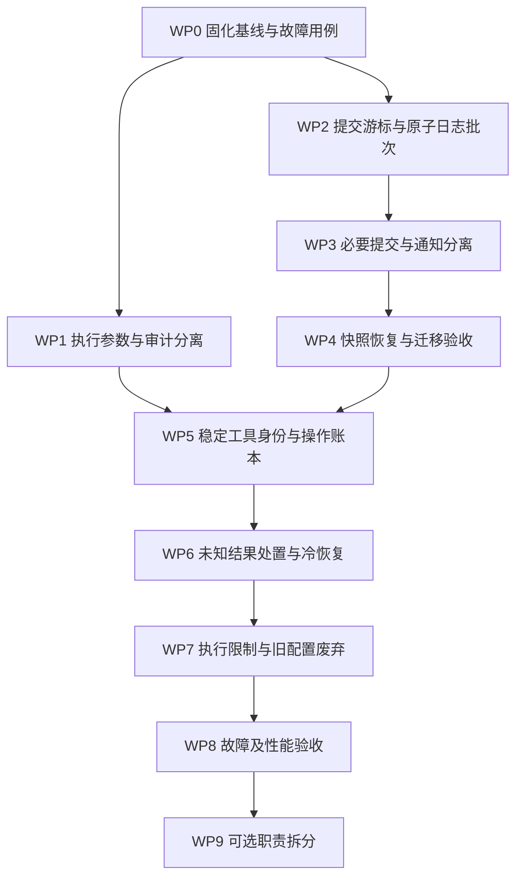

# ctx-weft 架构可靠性与扩展边界实施方案

> **实施流程：** 使用 `superpowers:executing-plans` 按工作包执行；先建立失败用例，再改变实现。本文是待验证方案，不表示修复已经完成。

**Goal：** 让事件提交、快照恢复和工具重入有可测试的可靠性契约，并逐步降低宿主扩展 Agent 内核时必须修改 core 的范围。

**Architecture：** 保留 protocols/core/providers、TaskRunner、TaskManager、StepDriver 和原子 memory.fold。第一阶段分离必要的事件提交与可降级的通知，建立按持久提交排序的日志与快照边界；第二阶段引入稳定工具调用身份和恢复策略；最后处理执行限制与可选的职责拆分。

**Tech Stack：** Python 3.11+、asyncio、dataclasses、pytest/pytest-asyncio、SQLAlchemy async、SQLite；PostgreSQL 由真实数据库集成测试单独验证。

**评审基线：** `b4b4b708ccf9ef67ac93130b276a910600ea97c8`，2026-09-11。

**本次交付：** 本文与 `docs/plans/verification/verify_agent_architecture.py`。没有实施下述生产代码变更。评审时工作区已有 `.zcode/` 未跟踪目录，不属于本方案。

---

## 1. 如何验证这份方案

不要仅以“测试变绿”“类变小”“接近某款产品”判定成功。对每项主张依次验证：

1. **现象成立：** 在基线提交上复现错误，并保存实际输出。
2. **根因成立：** 注入的故障确实位于所指边界，而非测试模拟出了不可达路径。
3. **修改有效：** 同一输入和故障位置下，目标不变量成立。
4. **没有转移问题：** 检查是否改成丢弃任务、永久等待、泄露数据或不再执行任何工具。
5. **代价可接受：** 比较延迟、数据库往返、恢复耗时与宿主迁移成本。

### 1.1 主张、证据和结论边界

| ID | 主张 | 当前证据 | 目标效果 | 不据此声称的效果 |
|---|---|---|---|---|
| H1 | 落库失败仍会对外通知成功 | 已做组件故障注入 | 失败不能伪装成已提交事实；会话停止继续推进 | 任意业务修改与任意外部数据库自动获得一个全局事务 |
| H2 | 延迟提交的旧 ID 可能被快照跳过 | 已做同会话、两个 task 的组件交错复现 | 全量回放与快照增量恢复一致 | 仅添加序号就解决所有运行时状态竞态 |
| H3 | 工具副作用完成而结果写入失败时，恢复会重跑 | 已经过真实 Gateway/Reconcile 和模拟 Provider 复现 | 非幂等操作不再被盲目重跑；结果未知可见、可处理 | 对没有幂等/查询能力的外部系统保证 exactly-once |
| H4 | 脱敏参数传进真实 Provider | 已用假认证头复现 | Provider 收到授权后的有效参数，审计保留脱敏副本 | 解决所有凭证管理和日志泄露问题 |
| H5 | 部分公开限制没有运行时消费者 | 静态检索确认；本轮未做完整超时 E2E | 有效限制可以观测；旧无效字段明确废弃 | Python 协作取消能杀掉所有阻塞代码或远程作业 |
| H6 | Runtime 和默认行为策略耦合较重 | 职责、依赖与调用路径分析 | 指定扩展任务可经公开接口实现，行为保持兼容 | 文件变短必然提高质量；重构必然提高 Agent 成功率 |

H1 的旧测试明确要求吞掉存储错误，因此属于**旧可靠性契约需要修改**，不应简单表述为“完全没有测试”。H2 的现有快照测试没有覆盖此处交错。H3 的现有恢复 E2E 验证的是 dangling 工具应当重跑，没有覆盖外部操作已完成这一分支。

### 1.2 现在即可执行的四项探针

在仓库根目录运行：

```powershell
.venv/Scripts/python.exe docs/plans/verification/verify_agent_architecture.py --expect baseline
```

基线预期退出码为 `0`，表示**成功复现旧缺陷**，不是可靠性验收通过。输出应包含：

```json
{
  "H1": {"emit_rejected": false, "observer_count": 1, "stored_count": 0},
  "H2": {"snapshot_created": true, "full_replay_tasks": ["a", "b"], "snapshot_replay_tasks": ["b"]},
  "H3": {"result_write_failed": true, "external_effect_count": 2, "distinct_invocation_ids": 2, "recovery_error": null},
  "H4": {"provider_authorization": "***"}
}
```

修复后使用：

```powershell
.venv/Scripts/python.exe docs/plans/verification/verify_agent_architecture.py --expect fixed
```

目标：H1 拒绝提交且不通知；H2 两种恢复都有 A、B；H3 副作用次数为 1；H4 收到 `FAKE_TEST_TOKEN`。当前基线运行 `--expect fixed` 应退出 `1`。

> **状态更新（2026-09-11，change `reliability-wp0-wp1` 落地后）：** H4 已修复——探针 observed 的 `provider_authorization` 已为 `FAKE_TEST_TOKEN`，`--expect baseline` 的 H4 check 转 `false`（缺陷不再复现，整体退出码随之转 `1`），H1/H2/H3 维持 `true`。故障注入未删除；`--expect fixed` 仍退出 `1`（H1–H3 未修）。

探针只用内存状态和假工具，不调用真实模型、HTTP、shell 工具或业务系统。H3 只替换能力发现函数，因为能力已经绑定；没有替换恢复、执行或结果写入路径。

**探针不足以单独验收：** H1/H2 还需 SQL 与真实 Runtime 集成；H3 还需真实进程退出、冷启动和“未知结果”处置；H4 还需审计输出和 HITL 参数改写测试。接口演进后允许调整探针的接线与故障注入位置，但不允许删除故障、改变副作用模拟或放宽目标断言以获得通过。

### 1.3 本轮已有测试证据

先前评审执行了以下命令，共 106 项通过：

```powershell
.venv/Scripts/python.exe -m pytest tests/unit/test_event_store_conformance.py tests/unit/test_event_persistence_wiring.py tests/unit/test_snapshot_recovery.py tests/integration/test_crash_recovery_reconcile.py tests/unit_protocols -q
```

这不是全仓通过证明，也没有 PostgreSQL 或性能数据。

## 2. 范围与方案选择

目标是**可嵌入的通用 Agent 内核**。第一阶段默认一个会话由一个 Runtime 进程拥有，可以并发执行不同 Agent 的任务；不支持两个进程同时恢复并执行同一个会话。

| 方案 | 做法 | 收益 | 代价与选择 |
|---|---|---|---|
| A：渐进修复，推荐并采用 | 先修明确缺陷，再完善提交与调用恢复契约，最后拆边界 | 可逐项证明收益，保留大部分宿主与循环实现 | 需要承认并管理迁移期契约差异 |
| B：完整事件溯源重写 | 所有领域状态改为 command/reducer 驱动，所有写操作围绕统一日志 | 长期可以获得更强的一致性模型 | 当前范围过大，容易同时改变 HITL、任务和记忆语义，不采用 |
| C：引入分布式工作流平台 | 把任务与重试迁到外部工作流系统 | 有利于跨进程调度、长时间服务端工作 | 增加部署依赖，不能自动解决工具幂等与上下文政策，不采用 |

本轮不增加 HTTP 服务、UI、向量数据库、Redis 或沙箱实现，不改变默认 Agent 的提示词、任务判决、摘要算法和工具并发语义。不会为了 H6 重构先重写整个 MemoryProvider。

## 3. 总体依赖与实施顺序



WP1 可以单独发布。WP2–WP4 是一个可靠性发布单元，在三者完成前不得宣布 H1/H2 已解决。WP5–WP6 是另一个发布单元；只有 operation_id 而没有恢复策略，不算解决 H3。WP9 可单独否决，不影响前面修复的价值。

每个工作包的执行步骤固定为：添加验收测试 → 基线运行确认失败原因 → 最小实现 → 定向回归 → 更新契约文档 → 形成独立提交。数据库迁移和回放顺序变更不得混入格式化提交。

## 4. H1/H2：事件提交、快照与故障隔离

### 4.1 当前根因

关键位置：

- `src/ctx_weft/providers/events/persister.py::EventPersister.on_event`：吞掉存储异常。
- `src/ctx_weft/providers/events/bus/in_process/bus.py::_fanout`：订阅者共用队列丢弃/异常吞掉策略，包含必要状态消费者。
- 同文件 `commit_provisional`：先弹出缓冲，再逐条投递，没有原子批次确认。
- `src/ctx_weft/providers/events/snapshot.py::_write`：快照游标采用触发事件 ID，内容通过另一次重建获取。
- `src/ctx_weft/core/control/reducers.py::rebuild_view`：增量按事件 ID 过滤。
- `src/ctx_weft/providers/events/store/sql/store.py`：读取按 ID 排序，各 append 单独提交。

两个不同的问题必须分别修复：**提交是否成功**与**快照究竟覆盖哪个日志前缀**。

### 4.2 不变量

| 编号 | 必须成立的约束 |
|---|---|
| E1 | 已对外声明为 committed 的非瞬态事件，必须已由 Store 确认；确认语义取决于后端，内存后端仍不能扛进程退出 |
| E2 | 同一个会话的持久日志位置唯一、单调；发生时间、run.sequence 和 event.id 都不代替提交位置 |
| E3 | 同一个 provisional 批次要么全部提交，要么全部未提交；确认丢失时可以按稳定 ID 查询或重试 |
| E4 | 快照 blob 必须恰好由日志位置不超过 C 的已提交事件生成，快照保存的 cursor 必须是 C |
| E5 | 全量回放与 snapshot(C)+delta(>C) 的领域状态等价；两个路径采用同一排序语义 |
| E6 | 观察者慢或失败不阻塞必要状态推进；必要提交/状态更新失败不能被记录日志后忽略 |
| E7 | 内部派生事件保留因果关系；未提交窗口的派生事件不能逃逸到宿主可见流 |
| E8 | 持久化故障后的内存对象不得继续被当成可靠状态推进新工具或新 task |

### 4.3 新增最小接口

建议在 `protocols/events.py` 引入以下类型与扩展协议，名称在此固定；实现期间不另造等价的第二套接口。

```python
@dataclass(frozen=True)
class StoredEvent:
    event: Event
    position: int

@dataclass(frozen=True)
class CommitReceipt:
    batch_id: str
    records: tuple[StoredEvent, ...]

class OrderedEventStore(Protocol):
    async def append_batch(self, session_id: str, batch_id: str,
                           events: list[Event]) -> CommitReceipt: ...
    async def read_range(self, session_id: str, *,
                         after_position: int = 0,
                         through_position: int | None = None) -> list[StoredEvent]: ...
    async def committed_head(self, session_id: str) -> int: ...
```

约束：

- `event.id` 继续作为事件身份，`position` 是存储层的提交位置；同会话排序依据 position。
- `batch_id` 在第一次提交前生成，重试不更换。批次相同内容返回原 receipt；相同 ID 不同内容抛 `EventConflictError`。
- 批内所有事件必须属于同一 session；同 event.id 不允许分属两个 session。
- 幂等比较忽略存储分配的 position，但比较原始 envelope/payload；不允许“相同 ID 任意内容都忽略”。
- 兼容 `append(event)` 由单事件 append_batch 实现，批次键确定性取 event.id。
- `RunSnapshot` 增加 `last_commit_position: int | None` 与 `projection_version: int`；原 ID/sequence 字段仅作兼容和诊断。
- 同一新版 Store 的 `read_by_session` 和 `read_session_events_of_types` 统一返回 position 顺序；旧 `read_after(id)` 不再用于新版快照恢复，并明确标记为 legacy API。

### 4.4 Store 实现与事务

内存实现用一把提交锁保护批次写入、幂等索引和会话位置分配。SQL 实现新增会话日志 head 与批次表，在同一事务中分配位置、插入整个 batch、记录 receipt。约束至少包含 `(session_id, position)` 唯一、`batch_id` 唯一、`event.id` 唯一。

PostgreSQL 使用会话 head 行锁；SQLite 使用可串行化该 head 更新的事务方式。不得用无锁的 `MAX(position)+1`。测试必须覆盖两个不同连接争用同会话 head，不以单协程测试代替数据库并发测试。

`append_batch` 的结果为“已确认提交”或异常；如果连接在 COMMIT 后断开，调用者面对的是**确认未知**，通过相同 batch_id 重试/查询获得原 receipt。不能新建 IDs 猜测性重发。

### 4.5 提交门与通知

采用独立的 `CommitGate`，由 Runtime 构造时接入事件通道，替代把 EventPersister 当成普通观察者的可靠性接线。保留 `runtime.event_bus` 的外部访问入口。

增加 `event_commit_policy = "required" | "best_effort"`，默认 `required`。其含义是必须获得已注册 Store 的写入确认，不等于内存 Store 获得磁盘持久性。`best_effort` 只用于显式接受丢事件的观测用途，启动时警告并禁用“可靠恢复”承诺。自定义 EventBus 不支持提交门时，required 模式构造失败并给出适配说明，不静默退化。

普通非瞬态事件路径：

1. 校验会话没有处于提交故障隔离状态。
2. 提交必要事实，取得 receipt。
3. 调用必要的进程内状态消费者；这类消费者不使用可丢弃队列，异常向上报告。
4. 通过独立观察通道发布 committed 通知。每个观察者有自己的有界队列；慢观察者不占用核心执行栈。

瞬态 token/progress 继续走实时通知，不逐 token 写 SQL。它们携带 provisional/committed 状态，不能被宿主当作持久成功事实。

订阅回调可能同步发出派生事件。**不得持有 Store 锁等待回调**，否则会产生重入死锁。每次持久提交使用短临界区；派生事实单独提交且在父事实之后。观察通知按 committed position 有序分发，即便内部回调嵌套发生也不能让观察者先看到子事实。

现有 `subscribe(..., provisional=True)` 用于 ALM/SessionRegistry 的状态推进，应显式登记为 required consumer；外部 `subscribe` 默认仍是观察者。观察者异常可以记录，required consumer 异常必须使会话进入不可继续推进状态。

### 4.6 provisional 的特殊处理

继续支持“首 token 前暂停可撤销这一轮”的宿主语义，不把整个会话的持久化关掉：

- 为一个窗口分配 `round_id`，缓冲范围依据 round 因果归属；嵌套派生事件通过执行上下文继承 round_id，不能仅检查 task_id，否则 session/agent 级派生事件可能逃逸。
- 必要的进程内状态消费者仍可先看到 provisional 状态，以支持 pause/cancel；该状态被明确视为推测性状态。
- commit 时将窗口标记为 COMMITTING，提交封闭批次。成功前保留原缓冲；失败不 pop、不重复执行业务。
- COMMITTING 期间该 round 的新发射先等待该批次结果，等待时不持 Store 锁；成功后作为后续提交，失败后拒绝推进。其他 round/会话仍能工作。
- 已先处理过的必要消费者不重复处理缓冲事件；外部观察者只收一次。派生事件保存 causation_id。
- 不把在旧 provisional 时刻计算的 session 聚合状态当成永远正确的最终值。窗口关闭后通过 SessionRegistry 重新聚合真实 task 状态，必要时发一条当前聚合事实。

这是增加 position 之外必须补的内容：**提交顺序可能不同于生成顺序，必须同时验证 live state、完整回放和快照回放**。只通过 A/B 任务集合探针不够。

这里不承诺所有领域状态在一个事务中改变。允许日志中出现合法的进行中前缀，例如有 TaskStarted 而暂时没有后续 Agent 状态事件；冷恢复必须能够处理这些前缀，并使状态确定地收敛。

### 4.7 提交失败的控制流

新增 `PersistenceUnavailableError`，在 Runtime、TaskManager 和后台 recap 的异常分支中先于通用重试处理：

- 标记会话的非持久健康状态为 `storage_unavailable`，公开查询与等待接口可得到该原因。
- 停止调度新 task/LLM/tool，取消或停住尚未完成的活动；不把持久化错误当作普通可重试 task 失败。
- 不再通过已经失败的事件链反复发 `TaskFinished/TaskRequeued/RunFinished`；错误通过控制接口或单独健康通知交给 host。
- 不伪造回滚成功。内存中的 task/agent 状态可能已变更，恢复必须从已提交日志与 memory/operation 事实重建。
- 恢复前使用 batch_id 确认未知提交，并处理推测性记录；不能简单清除健康标志后沿用旧对象。
- `wait_for_finish` 应明确抛出存储不可用错误，不能等到通用 300 秒超时才让宿主猜测。

自动继续无法确认的非幂等外部操作仍受 H3 的限制。提交恢复与工具恢复是两个不同判据。

### 4.8 快照读取边界

快照创建算法固定为：

```text
C = store.committed_head(session)
S = 最新且 projection_version 匹配、cursor <= C 的快照（可为空）
events = store.read_range(after_position=S.cursor 或 0, through_position=C)
view = apply(S.view 或空视图, events)
保存 snapshot(view, last_commit_position=C)
```

禁止取一次无上界的最新 view，再把较早触发事件的位置写成 cursor。快照触发事件只是“请求做快照”，不是快照边界本身。

快照可以后台创建；同会话只运行一个 writer。优先沿用 RunFinished/SessionFinished 的触发点，但接受其只是执行边界，不保证整个会话所有 task 都已经终态。失败的快照是性能降级，不是事件丢失；记录错误，仍可从日志重建。

projection_version 不匹配或 legacy 快照没有提交位置时，忽略该快照，执行有序全量回放后重新创建。不得猜一个位置继续增量读取。

### 4.9 数据迁移与兼容

1. 停止写入并备份 events/snapshots；迁移工具先做 dry-run，报告会话数、事件数和不完整事件。
2. 旧数据没有真实提交顺序，按旧契约的 `(session_id, event.id)` 排序分配位置；**不能据此恢复历史上已经丢掉的事件，也不能声称还原了旧实际提交顺序**。
3. 旧快照失效；用全部现存事件生成新投影，核验终态、任务结果、Agent 模型和 pending HITL。
4. 写入日志格式版本，切换所有当前 writer/readers；不允许新旧 writer 同时运行。
5. 自定义 Store 必须通过新版 conformance 后开启 required+snapshot。没有提交游标的 legacy Store 只能走明确的兼容全量读取模式，不能启用新版增量快照。
6. 回退到旧程序必须先停写并恢复迁移前备份；产生新数据后不能只换回旧二进制。需要保留新数据时，必须做显式导出转换与验证。

### 4.10 EventStore 与 MemoryProvider 的保证边界

二者仍然是独立存储；上面的提交门不使任意 `memory.ingest/fold` 和领域事件成为同一个事务。H1/H2 验收证明的是领域日志提交与投影恢复，不是任意崩溃点下所有原始上下文都原子恢复。

实施 WP3/WP4 时必须登记恢复路径上的双写点：用户输入入 memory、HITL 答复、工具结果、摘要折叠和终态产出。为可重放写入保留稳定 record ID/operation ID/round ID；能够从持久事实重建的记录采用幂等补写。无法判定某次 fold 是否已经完成且缺少重建材料时，保留健康故障并要求宿主修复或从备份恢复，不能直接清除隔离状态。

工具结果的双写修复由第 5 节账本承担。全面的 memory mutation journal 是独立扩展，当前不承诺实现。实施报告必须列出仍只能保守停止的故障位置；若业务要求这些位置也自动无损续跑，应扩大方案并单独设计，不能以本方案的 H1/H2 通过替代该承诺。

## 5. H3/H4：工具身份、执行数据与恢复政策

### 5.1 H4：参数分离的确定性规则

Gateway 内部固定区分：

| 数据 | 用途 | 是否允许脱敏 |
|---|---|---|
| original_arguments | 模型原始请求、审批指纹 | 不能为执行而破坏原值；公开展示使用单独副本 |
| effective_arguments | 授权/HITL 修改后、再次通过 schema 校验的参数 | 不脱敏，传 Provider |
| audit_arguments | 事件、普通日志、审计展示 | 对 effective_arguments 递归生成脱敏副本 |

鉴权顺序保持：原请求 → 授权/HITL → 修改后的参数重新校验 → 执行。不得因为 H4 修复绕过审批或使用审批前参数。第一工作包只修复当前 headers 问题并保证输入不被修改；扩展递归脱敏时必须补嵌套对象与敏感键测试，不宣称自动识别所有秘密。

冷恢复需要原执行参数时，从受保护的 operation/memory 存储读取，不从公开审计事件的 `***` 逆向恢复。

### 5.2 稳定逻辑调用身份

`invocation_id` 保留为一次实际执行尝试的身份，用于取消；新增 `operation_id` 标识跨重启的同一个逻辑调用。

建议由 `(tenant_id, session_id, agent_id, assistant_record_id, tool_ordinal)` 确定性生成 operation_id。assistant_record_id 必须在执行前稳定持久化；tool_ordinal 是本条 assistant 消息中的序号。不能只用 tool_call_id，也不能只哈希工具名和参数：模型会复用 call_1，而两个相同参数调用可能是两次合法操作。

`_ingest_assistant_turn` 返回结构化的 `PersistedAssistantTurn(record_id, tool_calls)`；所有执行入口携带 record_id 和 ordinal。被排除在对话 memory 外的控制工具仍需执行账本身份，不能因为 SILENT/DISPATCH 不入对话就丢失 operation_id。

ProviderContext 新增 `operation_id: str | None`。原 `invocation_id` 和 `extra['tool_call_id']` 继续兼容。普通执行、热 HITL resume、冷恢复必须引用相同 operation_id；每次真正调用 Provider 可有新的 invocation_id。

同时修改 Reconcile 的完成匹配：新版 TOOL_RESULT 以 operation_id 关联，不再用整个 task view 中所有 tool_call_id 构成的集合判断完成。否则旧回合的 call_1 结果可能错误地覆盖新回合的 call_1。LLM wire 仍使用模型提供的 tool_call_id，存储层身份与模型消息配对字段不可混为一谈。

历史 dangling 调用若缺少可靠的记录身份，默认进入结果未知处理，不用随机 ID 自动执行副作用工具。

### 5.3 最小操作账本

新增 `protocols/operations.py` 与内存/SQL `OperationStore`。账本和工具返回的业务系统不组成分布式事务。

```python
class OperationStore(Protocol):
    async def get(self, operation_id: str, ctx: ProviderContext) -> OperationRecord | None: ...
    async def prepare(self, record: OperationRecord, ctx: ProviderContext) -> OperationRecord: ...
    async def compare_and_set(self, operation_id: str, expected_revision: int,
                              update: OperationUpdate, ctx: ProviderContext) -> OperationRecord: ...
```

OperationRecord 至少包含：operation_id、tenant/session/task/agent、assistant_record_id、tool ordinal/name、授权后的参数及指纹、恢复策略、status、revision、attempt IDs、完整规范化结果或可持久读取的结果引用、error、HITL resume_state 引用、对应的 memory result ID。

状态：`prepared → started → completed`；工具明确停在人工节点为 `waiting_human`；无法确定业务结果为 `unknown`。已确认的工具失败也作为 completed outcome=error 保存；网络超时或取消不能自动当成“未执行”。

完整结果不得仅依赖审计事件中被截断的 8,000 字符文本。多模态引用必须在账本使用期间保持有效；结果保留期至少覆盖可恢复 task 的生命周期。账本是敏感执行数据，不能原样广播到 SSE。

执行顺序：

```text
持久 assistant/operation identity
→ 通过授权与校验
→ operation prepared
→ CAS 为 started（持久确认）
→ 调用 Provider
→ 保存完整 outcome，operation completed（持久确认）
→ 幂等写入 TOOL_RESULT memory
→ 发 CapabilityFinished
```

memory result ID 由 operation_id 确定性生成。账本 completed 而 memory 写入失败时，恢复重建 memory；不再次执行工具。这样缩小并可修复双写窗口，但不声称消灭“外部成功、账本 completed 尚未保存”这一窗口。

### 5.4 恢复策略

ToolCapability 增加显式 `recovery_policy`：`retry_safe | idempotent | queryable | manual`。默认 `manual`，而不是从现有默认 `side_effects=False` 推断安全；MCP 描述和旧 Provider 的副作用声明可能不完整。

| 策略/状态 | 恢复动作 | Provider 必须保证什么 |
|---|---|---|
| completed | 复用结果，补齐 memory/通知 | 结果或引用持久可读 |
| prepared 且从未进入 started | 可以开始首次执行，但仍重新检查当前授权约束 | started 之前不会产生外部副作用 |
| started + retry_safe | 用同 operation_id 重试 | 重试不会造成有害的重复副作用 |
| started + idempotent | 用相同 operation_id 作为幂等键重试 | 幂等作用域及保留期覆盖恢复窗口 |
| started + queryable | 先查询，结果为 completed/definitely_not_started/unknown | definitely_not_started 必须是权威结果，不能用“暂时查不到”代替 |
| started + manual | 标记 unknown，等待宿主处理 | 不自动执行 |
| waiting_human | 通过现有 HumanResumable 协议恢复 | 不把已经停住的工具重新从头 invoke |
| unknown | 停住并公开原因 | 不通过普通 task retry 绕过该状态 |

QueryResult 接口只用于声明 queryable 的 Provider；未实现则启动校验失败。幂等承诺来自 Provider，不由 core 假设。

控制工具单独核验：delegate 必须用 operation_id 找到已创建子任务；finish/metadata 必须是同身份幂等状态变化；ask_user 必须复用已有请求。不得全局给 control 标记 retry_safe 后省略验证。

### 5.5 结果未知的宿主接口

未知操作将 task 置于现有可恢复 `INTERRUPTED`，新增 `TaskErrorCode.TOOL_OUTCOME_UNKNOWN` 和 OperationUncertain 事件，带 operation_id、工具名、可用处理动作与脱敏摘要。

新增：

```python
await runtime.resolve_operation(
    operation_id,
    decision="supply_result" | "retry_confirmed" | "cancel_task",
    result=None,
    expected_revision=revision,
)
```

- supply_result：宿主已经核实外部结果，按 Provider 结果结构归一化，再补 memory。
- retry_confirmed：宿主明确承担重复执行风险，持久记录决定后才允许新尝试；原 operation_id 不变。
- cancel_task：停止该任务；不能声称撤销了已发生的外部动作。
- revision 不匹配拒绝，避免两个客户端重复处理；接口执行宿主权限校验。
- unknown 时直接调用普通 recover_agent，不得绕过上述决策重跑工具。

`retry_confirmed` 是业务动作授权点，只能由实际宿主/用户授权。执行本文不会替任何业务系统预先批准重试。

### 5.6 无持久账本的兼容行为

默认内存运行可以使用内存 OperationStore。宿主声明跨进程恢复时，必须提供持久 OperationStore；未提供则只恢复会话与对话状态，dangling 外部操作默认 unknown，启动时明确报告能力缺失。

不能因为 EventStore 是 SQL 就认为 memory、blob、operation 自动持久了。Runtime 启动检查与文档必须分别列出这四类后端。

## 6. H5：执行限制必须可解释、可测试

不直接激活旧 `max_turns_per_agent=20` 或 `Task.timeout_ms=60000` 默认值。它们此前未执行，突然激活会改变大量已有任务的结束时机，而且“Agent 生命周期”可能横跨许多用户请求。

新增独立、可选的 `ExecutionLimits`，由 RuntimeConfig 注入：

```python
@dataclass(frozen=True)
class ExecutionLimits:
    step_active_timeout_sec: float | None = None
    task_active_timeout_sec: float | None = None
    provider_timeout_sec: float | None = None
    max_actor_turns_per_task: int | None = None
    cleanup_grace_sec: float = 5.0
```

默认 None 明确表示不增加新的限制；现有有效的 act 轮数限制、LLM 自愈预算与内置 shell 超时继续生效。required 可靠性模式不等于自动限制任务时长。

语义固定如下：

- **task active time**：task 开始装配到本次 run 停止的实际墙钟时间，跨自动 retry 累计；排队、等待子任务和 HITL 等人不计入。
- **step active time**：单 step 执行期间的活动时间；嵌套 HITL 等待暂停计时，异步 source 并行时墙钟只算一次。
- **provider timeout**：每次 provider 方法/流的活动时间上限，不让远端持续发送 progress 无限续命；不包含显式等待人类的时间。
- **actor turns**：actor 主循环的一次逻辑 LLM 请求算一轮；同请求的网络自愈不重复计数。跨 task retry 计数，人工处理后继续同 task 不自动清零。observer/compact 的既有限制独立保留。
- deadline 使用 monotonic clock；持久化的是已消费时长和轮数，不是进程 monotonic 绝对值。
- 在派发 actor 请求前持久预占一轮。活动时长在阶段转换及最长每 1 秒 checkpoint；崩溃最多漏记一个 checkpoint 周期，文档如实说明。不能把频繁重启下的该计量称为严格计费上限。
- 超限进入 INTERRUPTED，错误码区分 TASK_DEADLINE_EXCEEDED、STEP_DEADLINE_EXCEEDED、PROVIDER_DEADLINE_EXCEEDED、ACTOR_TURN_LIMIT；不以 USER_CANCEL 混淆原因，不自动无限重试。
- 工具被取消时如果已经 started 且结果未知，先执行 H3 的 unknown 规则；timeout 不证明副作用未发生。
- 协作取消后最多等待 cleanup_grace_sec；不能合作的进程内 Provider 标记为未终止并阻止同会话继续副作用。需要硬隔离时由宿主提供进程/沙箱执行，不在这里假装 asyncio 可以强杀 Python 代码。

旧字段在模板解析/Runtime 校验中发一次去重的 DeprecationWarning，并在 README 明确写明“旧字段不提供限制保障，迁移到 ExecutionLimits”。`max_turns_per_agent` 不自动映射到 task 轮数；两者语义不同。旧字段在下一个有明确迁移说明的破坏性版本删除。

验收必须覆盖 hot HITL、cold resume、等待子任务、自动 retry、跨重启计数和仍不合作的 Provider。只测 sleep 超时不够。

## 7. H6：结构调整作为独立实验

这是维护性假设，排在可靠性修复之后。没有收益证据可以不实施。

### 7.1 第一轮只拆三个边界

| 边界 | 新的所有者 | 输入/输出 | 不搬过去的职责 |
|---|---|---|---|
| 恢复 | RecoveryCoordinator | session/agent 标识 → 重建结果、待处理操作、可续跑状态 | 不直接判任务成功或调 Provider 副作用 |
| 交互接入 | InteractionCoordinator | send/reply/pause/cancel 意图 → TurnHandle/请求视图 | 不保存第二份 task/agent 注册表 |
| 上下文政策 | ContextPolicy + 默认实现 | request/deps → sources、budget、composer 配置 | 不把 LLMClient、EventStore 或执行调度混进政策对象 |

Runtime 保留公开方法，委托以上对象。构造依赖显式注入；TaskManager 继续拥有任务状态，AgentLifecycleManager 继续拥有 Agent 身份与状态，SessionRegistry 继续拥有会话状态。

本阶段不公开任意替换整个 StepDriver 的接口。否则第三方 pipeline 可能跳过授权、结果记录或收尾不变量。先开放 ContextPolicy 这个较小接缝；替换 Observer 等需求在有真实宿主场景后单独设计。

MemoryProvider 暂时保留聚合接口以降低迁移成本。不要把工作历史、长期召回和 topic 一次性拆成多个存储并引入新的双写问题。

### 7.2 可证伪的收益标准

完成两个示例宿主：

1. 注入“禁用语义长期召回、保留任务历史和工具”的 ContextPolicy。
2. 注入“将一个可选知识源超时降级为空参考”的 ContextPolicy。

验收要求：只实现公开接口、注册 Provider，不修改 core，不继承私有方法，不导入 `core/runtime.py` 私有符号。默认策略重构前后的归一化事件轨迹、LLM 输入消息和任务结果等价。

行数只记录，不设“低于 1,000 行就成功”的指标。若拆分仅增加对象间转发、没有让上述宿主扩展变简单，应保留可靠性修复并撤销该结构调整。

## 8. 工作包、文件与检查命令

以下新路径是建议实施位置，当前尚不存在。路径在每个工作包中列出，避免实施者自行发明重复模块。

### WP0：固化证据与验收夹具

- 已提供：`docs/plans/verification/verify_agent_architecture.py`。
- 新建：`tests/integration/test_runtime_storage_failure.py`、`tests/integration/test_snapshot_commit_interleaving.py`、`tests/integration/test_tool_outcome_unknown.py`。
- 先把四个探针移植为完整 Runtime 测试；使用 asyncio.Event/barrier 控制时序，不用随机 sleep 碰运气。
- H3 增加子进程夹具：外部模拟服务使用独立 SQLite 计数器，确保 Runtime 进程退出后副作用证据仍存在。测试目录用 tmp_path，不连接真实服务。
- 保存原分支与候选分支的 pytest 输出、故障位置、Git SHA、Python/数据库版本。

### WP1：执行与审计参数分离

- 修改：`src/ctx_weft/core/loop/capability_gateway.py`。
- 新建：`tests/unit/test_gateway_argument_channels.py`。
- 先测试原始认证头、HITL 改写后的认证头、非敏感字段、输入 dict 不变、审计副本脱敏。
- 再将 Provider 调用从 sanitized 改为经验证的 effective_arguments；保留审计脱敏。
- 命令：`.venv/Scripts/python.exe -m pytest tests/unit/test_gateway_argument_channels.py tests/unit/test_gateway_authz_hitl.py tests/unit/test_event_redaction.py -q`。
- 可以独立提交与发布，不依赖日志迁移。

### WP2：有序日志与原子批次

- 修改：`src/ctx_weft/protocols/events.py`、两个 events/store 实现、SQL models。
- 新建：`tests/unit/test_ordered_event_store_conformance.py`。
- 新建迁移工具：`scripts/migrate_event_positions.py`，默认 dry-run，实际迁移必须显式参数。
- 参数化跑内存与 SQLite；PostgreSQL 使用独立 integration 配置，不静默跳过后宣称已支持。
- 验证部分写入回滚、同 batch 重试、ID 内容冲突、同会话两个连接争用、不同会话互不阻塞。
- 命令：`.venv/Scripts/python.exe -m pytest tests/unit/test_event_store_conformance.py tests/unit/test_ordered_event_store_conformance.py -q`。

### WP3：必要提交门、观察队列与故障控制

- 新建：`src/ctx_weft/core/events/commit_gate.py`，明确位于编排层；Provider 不反向依赖 Runtime。
- 修改：bus、persister、Runtime 构造、TaskManager 异常链、ALM/SessionRegistry 订阅接线、后台任务异常处理。
- 新建：`tests/unit/test_commit_gate.py`、`tests/unit/test_observer_backpressure.py`。
- required sink 错误传播；外部观察者慢/失败降级。测试 required consumer 递归发事件不死锁、顺序正确。
- 处理 `commit_provisional` 的失败保留与 COMMITTING 竞态；在本工作包中解决 round 因果传播，不留给宿主猜测。
- 命令：`.venv/Scripts/python.exe -m pytest tests/unit/test_commit_gate.py tests/unit/test_observer_backpressure.py tests/integration/test_runtime_storage_failure.py tests/unit/test_event_persistence_wiring.py -q`。
- 有意修改旧“persister 吞异常”的测试，区分 required 与显式 best_effort 两种契约。

### WP4：快照边界、完整回放与迁移

- 修改：snapshot writer、reducers/replay、SessionRegistry/Runtime 的恢复读取；移除新版恢复对 ID 游标的依赖。
- 新建：`tests/unit/test_snapshot_consistent_cut.py`、`tests/integration/test_event_position_migration.py`。
- 校验 E1–E8；特别比较 session/task/agent/HITL/outputs，而不只看 tasks 的集合。
- 命令：`.venv/Scripts/python.exe -m pytest tests/unit/test_snapshot_recovery.py tests/unit/test_snapshot_consistent_cut.py tests/integration/test_snapshot_commit_interleaving.py tests/integration/test_event_position_migration.py -q`。
- WP2–WP4 联合验收通过之后，才切换生产宿主的日志格式。

### WP5：operation identity、账本与参数保存

- 新建：`src/ctx_weft/protocols/operations.py`、`src/ctx_weft/providers/operations/in_memory.py`、`src/ctx_weft/providers/operations/sql.py`。
- 修改：ProviderContext、ToolCapability、Registry、ActStep、Gateway、Runtime 接线。
- 新建：`tests/unit/test_operation_store_conformance.py`、`tests/unit/test_operation_identity.py`。
- 先验证 tool_call_id 复用、同参数的两次合法调用、同逻辑调用跨重启 identity 不变。
- 再引入 result 账本与确定性 memory ID。大结果、多模态、权限改写和 blob 生命周期必须覆盖。
- 命令：`.venv/Scripts/python.exe -m pytest tests/unit/test_operation_store_conformance.py tests/unit/test_operation_identity.py tests/unit/test_gateway_argument_channels.py -q`。

### WP6：恢复政策、未知结果处理与控制工具

- 修改：ReconcileStep、HITL 恢复、Runtime resolve_operation、错误码和事件投影。
- 新建：`tests/unit/test_operation_recovery_policy.py`、`tests/integration/test_operation_crash_matrix.py`。
- 验证所有恢复策略表分支；未知副作用不得因 generic retry、recover_agent 或 HITL 冷回复而被重复执行。
- control/delegate 使用操作身份去重；测试创建子任务成功后确认丢失。
- 命令：`.venv/Scripts/python.exe -m pytest tests/unit/test_operation_recovery_policy.py tests/integration/test_operation_crash_matrix.py tests/integration/test_tool_outcome_unknown.py tests/unit/test_hitl_reconcile.py tests/integration/test_crash_recovery_reconcile.py -q`。
- 更新旧“所有 dangling 都重跑”的测试，仅在明确 retry_safe 的夹具中继续要求重跑。

### WP7：执行限制与无效配置迁移

- 新建：`src/ctx_weft/core/control/execution_budget.py`。
- 修改：RuntimeConfig、StepDriver、TaskManager、LLM/Gateway Provider 等待边界、HitlWaiter 与模板加载器。
- 新建：`tests/unit/test_execution_budget.py`、`tests/integration/test_execution_limits.py`。
- 使用可注入 monotonic clock 验证预算算术；真正的异步阻塞/取消行为用 barrier 驱动集成测试。
- 命令：`.venv/Scripts/python.exe -m pytest tests/unit/test_execution_budget.py tests/integration/test_execution_limits.py tests/unit/test_hitl_waiter.py tests/unit/test_run_tokens.py -q`。
- 先实现 opt-in ExecutionLimits，再给旧无效字段加弃用说明；不激活旧默认值。

### WP8：整体可靠性与性能门禁

- 新建：`scripts/benchmark_runtime_commit.py`，输出机器可读 JSON，固定 MockLLM 和 Provider 延迟。
- 将第 9 节完整矩阵跑完；所有明确缺陷必须有回归测试，所有未完成项在报告中列出。
- 定向测试通过后，全量运行：`.venv/Scripts/python.exe -m pytest tests -q`。
- 必须审阅 skip/xfail；PostgreSQL 未运行时报告“不验证 PostgreSQL”，不能写“全后端通过”。
- 若已有基线失败，保存相同环境下的基线证据；不能把候选新增失败归入历史失败。

### WP9：独立的职责拆分

- 新建：`core/orchestrator/recovery.py`、`core/orchestrator/interaction.py`、`core/assembler/policy.py`。
- 修改：Runtime 为 facade，保持公开调用签名和事件语义；不同时改提示词或记忆算法。
- 新建：`tests/integration/test_context_policy_extension.py`、`tests/integration/test_runtime_refactor_trace_equivalence.py`。
- 先保存默认行为轨迹，再拆一个边界、验一次；三个边界不要在一个无法审查的大提交内一起搬迁。
- 命令：`.venv/Scripts/python.exe -m pytest tests/unit/test_runtime_public_api.py tests/unit/test_runtime_agent_api.py tests/integration/test_context_policy_extension.py tests/integration/test_runtime_refactor_trace_equivalence.py -q`。

## 9. 验收矩阵

### 9.1 事件、恢复与通知

| 测试 | 故障/交错 | 必须观察到 |
|---|---|---|
| E-T01 | append 前失败 | 无 committed 通知，Runtime 停止后续副作用 |
| E-T02 | SQL 批次中第 k 条插入失败 | 整批不存在，缓冲可重试，既存批次不受影响 |
| E-T03 | SQL COMMIT 成功但 receipt 丢失 | 相同 batch_id 重试得到原位置，无重复事件 |
| E-T04 | A 延迟提交，B 触发快照 | A 不丢；新全量与增量等价 |
| E-T05 | 获取快照 head 后并发提交 | blob 不混入超过 C 的事件；新事件由 delta 应用一次 |
| E-T06 | 快照损坏/版本不匹配 | 明确降级或报错；不能把错误快照当真继续 |
| E-T07 | 回调嵌套发 Agent/Session 派生事件 | 不死锁，父事实先于子事实对外可见 |
| E-T08 | provisional 事件派生出不同 task_id/无 task_id 事件 | round 归属保持，撤销时外部看不到逃逸事件 |
| E-T09 | 同会话多个窗口一提交一撤销 | live/full/snapshot 在窗口关闭后等价，无幽灵 task/Agent |
| E-T10 | 观察者不消费、队列满 | 主循环不挂死；通知明确存在缺口，客户端可按位置补读持久事件 |
| E-T11 | required consumer 抛错 | 进入健康故障状态，不能吞异常继续执行 |
| E-T12 | 事件提交后、内存派生状态更新前进程退出 | 冷恢复收敛，不重复推进已确认副作用 |
| E-T13 | 从 legacy 数据迁移 | 当前可重建业务字段等价；旧快照不被误用 |
| E-T14 | 会话 A 存储故障，会话 B 正常 | A 被隔离，B 可继续；全局 DB 故障另行如实报告 |

对 E-T09/E-T12，比较器仅归一化随机 ID/时间戳，不排除状态、outputs、error_code、HITL、操作身份、调用次数或 token 计量等业务差异。历史中缺失的数据列为不可恢复，不“补造”以通过比较。

### 9.2 工具执行

| 测试 | 故障/场景 | 必须观察到 |
|---|---|---|
| O-T01 | 认证头原值 | Provider 原值，审计脱敏 |
| O-T02 | 人类修改参数 | 修改后再校验，执行新值，恢复使用同一有效参数 |
| O-T03 | prepared 之前崩溃 | 没有外部副作用 |
| O-T04 | started 后、调用前崩溃 | manual 策略保守 unknown；不能假装确定未执行 |
| O-T05 | 外部成功、completed 之前崩溃 | manual 不重跑；idempotent/queryable 按契约恢复 |
| O-T06 | completed 后、memory 写入前崩溃 | 从完整账本补结果，外部副作用仍一次 |
| O-T07 | memory 后、CapabilityFinished 前崩溃 | memory 幂等，通知可以补发，副作用不重复 |
| O-T08 | task retry/恢复多次重复进入 | 同 operation_id，不因多次 recover 多做一次 |
| O-T09 | 两条 assistant 都使用 call_1 和同参数 | 两个合法 operation_id，不误去重 |
| O-T10 | HITL 等待与回复的热/冷竞态 | 同一个请求和操作只由一个执行者继续 |
| O-T11 | unknown 后普通 recover_agent | 仍受 unknown 闸门约束 |
| O-T12 | 两个宿主请求同时 resolve_operation | revision 只允许一个决定成功 |
| O-T13 | 结果超过 8,000 字符或含图片 | 恢复完整规范化结果，非审计截断文本 |
| O-T14 | delegate 创建成功后确认丢失 | 重入找到原 child，不生成第二棵子任务树 |
| O-T15 | 授权撤销/策略改变后准备重试 | 重新检查授权约束，不靠历史批准无限放行 |
| O-T16 | 远端取消请求失败 | unknown/仍在运行状态可见，不宣称外部停止 |

O-T05/O-T06 至少各有一条使用子进程强制退出与新的 Runtime 实例，不能全部由同进程 monkeypatch 代替。

### 9.3 限制与扩展

| 测试 | 条件 | 必须观察到 |
|---|---|---|
| L-T01 | opt-in step/provider deadline | 在预算+清理宽限内停止合作型调用，错误码正确 |
| L-T02 | 长时间 HITL/等待子任务 | 不消费 active time；恢复后继续剩余预算 |
| L-T03 | task 自动重试 | 时长/actor 轮数不重置；无无限 retry |
| L-T04 | 进程重启 | 持久轮数恢复；时长漏记不超过声明的 checkpoint 窗口 |
| L-T05 | 不合作的 Provider | 明确仍未终止；拒绝同会话继续副作用 |
| L-T06 | 旧无效配置 | 发弃用提示，不制造已有默认行为变化 |
| X-T01 | 两个示例 ContextPolicy | 无 core 修改，无私有导入，无私有继承 |
| X-T02 | 默认 ContextPolicy | 重构前后归一化 prompt/事件/结果等价 |

## 10. 性能、观测与发布门禁

### 10.1 固定负载

使用相同 Python、机器、数据库配置、MockLLM token 数和 Provider 延迟，对原版与候选各做 5 次预热、30 次测量，保留每次原始结果：

1. 单会话：100 次普通工具调用，工具每次延迟 5 ms。
2. 同会话 4 Agent，各 50 次工具调用；保持当前调度并发上限。
3. 10 个独立会话，验证隔离与观察者背压。
4. 恢复 1,000/10,000/100,000 条事件的日志，分别开启/关闭快照。
5. 一个阻塞观察者和一个正常观察者并存。

指标：运行耗时 p50/p95、事件提交延迟 p95、每工具调用 SQL 事务数、峰值内存、恢复读取事件数/耗时、观察通知积压/丢弃、存储错误数、unknown operation 数及停留时间。

新增可靠性必然可能增加 I/O，不能预先宣称性能更快。建议工程门禁：在 SQLite 单进程固定夹具下 p95 运行耗时回退不超过 15%；超过时报告原因并优化批次，不通过恢复吞异常来换性能。该 15% 是待验证的验收预算，不是已测结论；真实宿主可另定 SLO。

快照的明确目标是：日志增长但 snapshot 后 delta 数固定时，恢复读取的事件行数不随总日志规模线性增长。领域状态 blob 随 task 数增长的成本另行计量，不承诺总恢复时间严格 O(1)。

### 10.2 发布与回退

- WP1 独立发布，保留 H4 探针与事件脱敏回归。
- WP2–WP4 先在一套测试宿主迁移备份上运行，再灰度一个可恢复会话样本集；停止混用旧 writer。
- WP5–WP6 先接只读 retry_safe 工具和一个真正支持幂等键的模拟工具，再接需人工处置的副作用工具。
- ExecutionLimits 默认 opt-in，宿主先配置小范围任务；不能在用户不知情时启用旧默认限制。
- 出现数据不一致停止扩大灰度，保留原日志、账本与备份。不得删掉“异常事件”让回放测试变绿。
- WP9 是纯结构变更，可靠性行为已稳定后独立发布；失败可单独回退该提交。

### 10.3 最终核验材料

交付实现时至少附以下表格，空项写“未验证”，不能写“预计通过”：

| 项目 | 基线结果 | 候选结果 | 证据文件/命令 | 结论 |
|---|---|---|---|---|
| H1 存储失败后不伪报成功 | 可复现失败 | 待填写 | 探针 + Runtime/SQL 测试 | 待验收 |
| H2 三种状态一致 | 快照漏 A | 待填写 | 交错/一致切面/迁移测试 | 待验收 |
| H3 不盲目重复副作用 | 计数为 2 | 待填写 | 账本与真实退出矩阵 | 待验收 |
| H4 执行参数正确 | 认证头变 *** | 待填写 | 参数/HITL/审计测试 | 待验收 |
| H5 限制与弃用可解释 | 静态无消费者 | 待填写 | 限制集成与迁移测试 | 待验收 |
| H6 扩展无需改 core | 当前缺少此接缝 | 待填写 | 示例宿主、轨迹等价与变更范围 | 可独立否决 |
| 性能预算 | 未测量 | 待填写 | 原始 benchmark JSON | 待验收 |

## 11. 业界对照的使用边界

对照用于解释设计取舍，不能作为本仓实现正确的证明：

- Codex App Server 的 Thread/Turn/Item 和 steer/interrupt 接口体现稳定宿主边界：[官方文档](https://learn.chatgpt.com/docs/app-server)。本方案没有声称 Codex 使用这里提出的提交序号或 OperationStore。
- Claude Code 的公开 agentic loop 说明工具、上下文与执行环境的组合：[官方说明](https://code.claude.com/docs/en/how-claude-code-works)。其公开说明不能证明内部 Observer 或恢复算法具体如何实现。
- OpenCode 的 TUI/server 与 OpenAPI 接口体现交互端和执行服务的分离：[官方文档](https://opencode.ai/docs/server/)。本方案借鉴边界，不要求 Python 内核增加 HTTP。
- 执行隔离与调用授权是不同保障：[Claude Code 沙箱文档](https://code.claude.com/docs/en/sandboxing)。本方案没有实现 OS 沙箱，也不把 shell 黑名单计入上述可靠性验收。

**实施完成的判据：** H1–H5 的目标、负向和故障路径均有证据，迁移与限制说明如实，性能代价可见。H6 只有通过示例宿主与默认行为等价实验才接受。未验证的效果继续保留为假设，不因方案已经写出而升级为事实。
